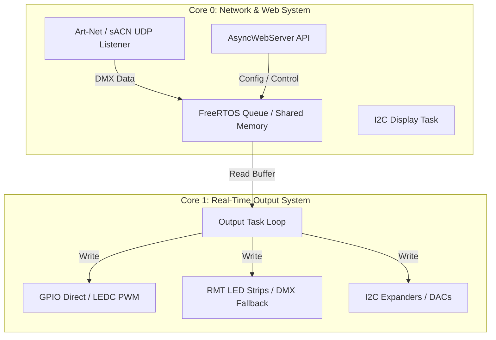
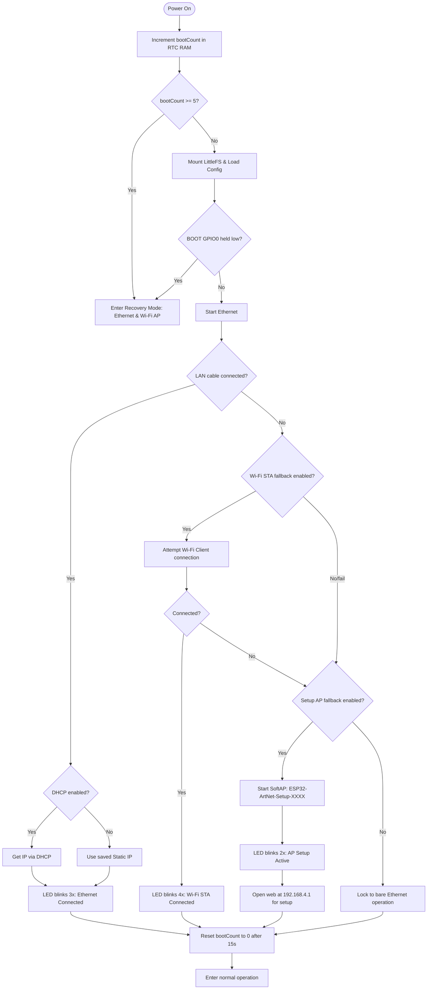

# Domain Model: ESP32 Art-Net Firmware

This document is the result of a `/grilling` domain-modeling session, extracted primarily from `include/output_control.h`, `include/scoring.h`, `include/config.h`, `src/main.cpp`, `web/index.html`, `docs/user_manual/main.typ`, and `docs/resource_calculator.md`.

## Core Domain

This project is firmware for the WT32-ETH01 that receives DMX data from Art-Net, sACN, or ESP-NOW and converts it into physical outputs such as LED, DMX, relay, dimmer, motor, servo, audio trigger, and smoke shooter.

The central entity is an `OutputChannel`, which represents one physical output with routing information, DMX address, type-specific settings, runtime state, and the necessary peripheral handles.

### Hardware Architecture

The **WT32-ETH01** board uses a dual-core ESP32 (Dual-Core 240MHz) together with the **LAN8720A Ethernet PHY**. The workload is split as follows:

- **Core 0 (Network & Control Core):** Handles all networking tasks (Ethernet, Wi-Fi SoftAP/STA, UDP Listeners, Web Server, and I2C Display)
- **Core 1 (Real-Time Output Core):** Handles output processing (DMX Serial, LED strips, PWM, Stepper/Motor control) so real-time signal timing is not disrupted by network traffic



## Ubiquitous Language

| Term | Meaning | Source of Truth |
| --- | --- | --- |
| Output Channel | A single config entry controlling one device | `OutputChannel` in `include/output_control.h` |
| Output Type | Device type ID v3 `0..18` | `outputTypeName()` in `include/scoring.h` |
| Source | Origin of a pin/channel: ESP32 GPIO, PCA9685, digital expander, I2C DAC (MCP4725, DAC7571, DAC7573) | `source` fields in `OutputChannel` |
| DMX Start Universe | The first universe this channel reads from | `start_universe` |
| DMX Start Address | 1-based DMX address within the universe | `start_address` |
| Resource Score | Hardware resource usage score | Contract: Configuration Contract; implementation: `estimateResources()`, `resourceScore()` |
| Compute Score | CPU/runtime load score | `channelComputeScore()`, `fpsComputeFactor()` |
| Interlock | Rules preventing conflicting or invalid configs | `validateOutputJson()`, `validateSettingsAndOutputs()` |
| Runtime State | Transient state such as smoke, solenoid, stepper commands | fields in `OutputChannel` |

## Bounded Contexts

### Configuration Context

Responsibilities:
- Store system settings in NVS `Preferences`.
- Store output layout in LittleFS `/outputs.json`.
- Migrate config layout to version 3.
- Sanitize values such as `output_fps`.

Key files:
- `include/config.h`
- `include/output_control.h`
- `src/main.cpp`

Key rules:
- `output_fps` must be in range `1..44`.
- Current layout version is `3`.
- `web/index.html` is the UI source; `include/web_pages.h` is a generated file.

#### End-User Configurable Parameters (Web UI)

All `SystemConfig` fields are exposed via the Web UI settings page at `/settings`:
- **Network:** Ethernet DHCP/IP/mask/gateway/DNS, Wi-Fi STA SSID/pass/IP/mask/gateway/DNS, AP SSID/pass, mDNS hostname
- **Protocol:** Art-Net port, sACN enable/multicast/port
- **Output:** Global FPS, Status LED pin, Zero-Crossing pin
- **I2C:** SDA/SCL pins, bus speed
- **Display:** Enable/disable, type (SSD1306/SH1106), I2C address, brightness
- **Mode:** Device mode (Art-Net Ethernet, ESP-NOW Master, ESP-NOW Slave)

Output channel layout (`/outputs.json`) is configurable via the Web UI outputs page at `/outputs`.

**Not exposed in Web UI** (compile-time only):
- ESP-NOW chunk size (`ESPNOW_DMX_CHUNK_SIZE`), FreeRTOS queue depth, score limits
- Hardware pin reservations (board-specific, wired to LAN8720 — non-configurable)

#### Storage Strategy

The system stores configuration in two parts:

**A. NVS Preferences Storage (System Config)**
- Scope: Small system configs required for network startup and basic boot, such as IP Address, Wi-Fi Credentials, Device Mode, I2C Speed, Display Type, Art-Net/sACN Ports
- Namespace: `"system"` in the ESP32 Preferences Library
- Lifecycle: Loaded via `loadConfig()` immediately on boot before network init; saved via `saveConfig()` when System Settings are saved from the web UI

**B. LittleFS File System (Output Layout & Routing Data)**
- Scope: Flexible output channel data structures with many parameter fields or array-like data
- Key files: `/outputs.json` (output channels), `/espnow_peers.json` (ESP-NOW peer routing)
- Version migration: `loadChannels()` checks the `"version"` field; v1/v2 → v3 converts type IDs automatically, skips deprecated outputs (WiZ Bulbs); after successful migration, it writes back as v3

#### Network Identity & Naming

- SoftAP SSID and mDNS Responder name are suffixed with the last 4 characters of the MAC address (e.g., `ESP32-ArtNet-Setup-XXXX` and `[mdns_name]-[xxxx].local`)
- ArtPollReply device names (Short/Long Name) are suffixed with the MAC suffix (e.g., Short Name: `CHAL Node-XXXX`)
- In Recovery Mode, mDNS registers as `[mdns_name]-recovery.local` (no MAC suffix)

#### Recovery Mode

- Triggered by 5 consecutive resets (boot counter) or pressing the BOOT button (GPIO0) during power-on
- Enables Dual Network: Ethernet and Wi-Fi AP simultaneously; AP SSID is `ESP32-ArtNet-Recovery-XXXX` as an open AP (no password)
  - **Wi-Fi channel note:** Recovery AP uses default ESP32 channel. If the board was in ESP-NOW mode before entering recovery, slaves on a different channel will disconnect. Normal ESP-NOW channel is restored after reboot.
- Disables all output functions and lighting stream tasks
- Async Web Server stays active for config and `/update` page for OTA firmware recovery
- **Consecutive Reset Counter:** Uses `bootCount` in RTC Fast Memory; incremented on each boot; `resetBootCountTask` delays 15 seconds then clears the counter; if counter reaches `>= 5` before clearing, the system enters Recovery Mode on the next boot
- **Physical GPIO0 Trigger:** If GPIO0 is detected as LOW in `setup()`, the system enters Recovery Mode directly

#### Wi-Fi Auto-Reconnection

- Retries Wi-Fi reconnect at most every 10 seconds (rate-limited)
- Skips Wi-Fi Client connection attempt entirely when the device is in Ethernet mode and a LAN cable is connected (`ethConnected || ETH.linkUp()`)

### Output Routing Context

Responsibilities:
- Convert DMX bytes into signals appropriate for each device.
- Handle multiple source types: GPIO, PCA9685, MCP23017, TCA9555, PCF857x, MCP4725, DAC7571, DAC7573.
- Support hybrid routing for multi-pin outputs such as stepper, motor, RGB/RGBW, 7-segment, and smoke shooter.

Key files:
- `include/output_control.h`
- `include/motion_control.h`
- `include/pca9685_control.h`
- `include/i2c_gpio_expander.h`
- `include/funcgen_control.h`
- `include/dfplayer_control.h`

Key rules:
- Stepper STEP pin must be ESP32 GPIO.
- Motor EN in `IN1+IN2+EN` mode must be ESP32 GPIO or PCA9685 (requires PWM).
- PCA9685 shares frequency per chip; servo forces 50 Hz.
- Digital expanders are suitable for digital output only, not PWM timing.
- Every `Wire` (I2C) operation must be protected by `xSemaphoreTake(i2cMutex, pdMS_TO_TICKS(100))` — including PCA9685, MCP23017, I2C DAC, and display drawing
- I2C Display task (Core 0) uses a queue to avoid frequent I2C bus contention

### Protocol Input Context

Responsibilities:
- Receive DMX frames from Art-Net, sACN, or ESP-NOW.
- Expose new data to the output task in a core-safe manner.

Key files:
- `include/artnet_control.h`
- `include/sacn_control.h`
- `include/espnow_control.h`
- `src/main.cpp`

Key rules:
- Core 0 handles network/display/web.
- Core 1 processes outputs.
- Atomic flags like `networkFramePending` must be used safely across dual-core.
- ESP-NOW callback must defer via queue, not do heavy work in the callback.

#### Art-Net Protocol

- Supported OpCodes: `0x5000` (OpDmx) for receiving DMX frames, `0x2000` (OpPoll) for device discovery
- **ArtPollReply:** On receiving OpPoll, builds an `ArtPollReplyPacket` and sends it back to the requester with:
  - Short Name: `"CHAL Node-XXXX"`, Long Name: `"CHAL WT32-ETH01 Converter - XXXX"`
  - Node Report: `"#0001 [OK] System healthy and ready."`
  - IP/MAC Address and list of active output universes (max 4 universes per ArtPollReply)
- Universe is stored in Little-Endian format; Length in Big-Endian format

#### sACN Protocol (ANSI E1.31)

- Supports both Unicast and Multicast
- **Multicast Group Registration:** Automatically calculates and joins the Multicast IP (`239.255.X.Y`) based on each output's universe
- **Priority-based Source Selection:** Listens to up to 4 sources simultaneously; compares sACN Priority (0-200); processes only the highest-priority source; if the primary source is lost for over 2500 ms, falls back to the next source

#### ESP-NOW Master

- Receives Art-Net/sACN and forwards DMX to slaves according to peer routes stored in `/espnow_peers.json`
- Peering: Stores MAC Address and DMX Universe/Address range for each peer; if the peer list is empty, broadcasts to `FF:FF:FF:FF:FF:FF`
- DMX Chunking: Splits 1 Universe (512 channels) into chunks up to `ESPNOW_DMX_CHUNK_SIZE` (200 bytes data + 12 bytes header)
- Keep peer routes as narrow as possible to reduce airtime
- ESP-NOW requires Wi-Fi radio enabled (`WIFI_AP_STA` when needed)
- Future: Make DMX chunk size user-configurable; separate `configured_chunk_size` from compile-time max receive buffer; slaves reject packets with `length` exceeding max buffer

#### ESP-NOW Slave

- Receives packets via callback, queues them for processing in `outputTask`, then maps by universe/offset to output channels
- Core-Safe Deferral: callback (Core 0) pushes data into FreeRTOS Queue (Queue Depth 16); Core 1 (`outputTask`) reads from the queue and processes
- Always-On Setup AP: In Slave mode, the board keeps SoftAP (SSID `ESP32-ArtNet-Setup-XXXX`) active for web configuration even without a LAN cable

#### ESP-NOW DMX Packet Structure

| Byte Range | Field Name | Data Type | Description |
| :---: | :--- | :---: | :--- |
| 0..2 | Prefix Magic | `char[3]` | Constant `"DMX"` for packet filtering |
| 3..4 | Universe | `uint16_t` | DMX Universe (0..32767) |
| 5..6 | Offset | `uint16_t` | Start offset within the Universe (0..511) |
| 7..8 | Total Length | `uint16_t` | Full universe size (typically 512) |
| 9..10 | Chunk Length | `uint16_t` | DMX data size in this packet (max chunk_size) |
| 11 | Sequence | `uint8_t` | Sequence counter for stability checking |
| 12.. | DMX Payload | `uint8_t[]` | Actual DMX channel values |

Peer route limits universe to `0..32767` and DMX address to `1..512`; slave maps each packet immediately by `universe`/`offset` without waiting for full reassembly, except for the universe 0 status buffer; if the peer route exceeds chunk size, the master sends multiple packets incrementing `offset` by chunk_size

### Validation And Interlock Context

Responsibilities:
- Prevent configurations that would crash the firmware, cause peripheral conflicts, or make hardware inoperable.
- Validate on both the C++ API and Web UI sides.

Key files:
- `src/main.cpp`
- `web/index.html`

Key rules:
- No duplicate GPIOs allowed.
- Output pins must not conflict with Status LED, Zero-Crossing, I2C SDA/SCL.
- DFPlayer limited to 2 channels (uses UART1/2).
- DFPlayer has priority on UART allocation; DMX GPIO uses remaining UARTs first, then falls back to RMT.
- RMT usage (LED strips + DMX fallback) must not exceed 8 channels.
- Source must match the output type.
- **GPIO12 (MTDI) Avoidance:** GPIO 12 is a Bootstrap Pin — strictly forbidden; Web UI must show a warning if the user enters GPIO 12
- **AC Dimmer Zero-Crossing Interlock:** If `zc_pin == 255` (disabled), AC Dimmer output is locked to 0; Web UI must show a ZC Pin Missing Warning
- **PCA9685 Shared Frequency Conflict:** If devices with different frequency requirements (servo 50Hz + LED >200Hz) are mixed on the same PCA chip, Web UI and API show a warning but do not block saving
- **DMX Frame Timeout:** Core 1 loop must not perform any blocking operation that causes DMX Frame Cycle to exceed 50ms; initial FPS is forced to 30-40 FPS

### Capacity Scoring Context (Refactored v2)

The scoring system uses **three independent budgets**:

| Budget | What it counts | Limit | Blocks save? |
|--------|---------------|-------|:---:|
| **HardwareResource** | Finite ESP32 peripherals: LEDC, RMT, UART, internal DAC, timers | `ledc ≤ 16`, `rmt ≤ 8`, `uart ≤ 2`, `dac ≤ 2`, `timer ≤ 4` | ✅ Source-aware block |
| **CpuBudget** | Output service time: serialized DMX/WS281x/TM1637, active I2C writes, and 500 µs base overhead | `≤ (1,000,000/fps) - 1,500` µs | ✅ Yes |
| **RamBudget** | Static buffer estimates per type | `≤ 65535` (64 KB) | ✅ Yes |

Key files:
- `include/scoring.h`
- `web/index.html`
- `docs/resource_calculator.md`

Key rules:
- **GPIO is NOT counted** — expanders (I2C) can substitute for GPIO pins. Active I2C transactions are reflected in CpuBudget.
- **PCA9685 / digital expander channels are NOT counted as hardware** — they consume I2C bus time, added as `+180 µs` per active write transaction.
- **ESP-NOW Master overhead** is a separate CPU/RAM cost: `cpuUs = 500 + peers×ceil(512/chunkSize)×170 + universes×100`, `ramBytes = 512 + peers×(chunkSize+44)`.
- All three budgets are checked independently; CPU and RAM **block saving**, hardware is **source-aware block** (types using PCA9685 or expander bypass the count).

Per-type active-frame service-time estimates in µs per frame. RAM includes `224 bytes` base `OutputChannel`/allocator estimate plus the firmware-allocated DMX value buffer. Simple outputs now allocate only the DMX bytes they actually read; DMX output still uses 512 bytes and LED strips use universe-rounded buffers.

| Type | CPU µs | RAM bytes | Notes |
|:---:|:---:|:---:|:---|
| 0 AC Dimmer | 5 + shared background timer cost | 225 | GPIO/state update; uses 1 shared hardware timer if any dimmer exists |
| 1 DMX | 22600 | 736 UART path; +20632 if RMT fallback | Full DMX512 transmit frame |
| 2 Relay | 5 | 225 | Digital state update |
| 3 RGB LED | `80 + led_count×3` RGB, `80 + led_count×4` RGBW | `224 + universes×512 + led_count×3 + 256` RGB, `224 + universes×512 + led_count×4 + 256` RGBW | CPU pixel mapping + RMT enqueue; RAM includes DMX + pixel buffers |
| 4 Single LED | 6 | `224 + valueBytes` | 1 PWM/PCA update setup |
| 5 Analog RGB | 18 | 227 RGB / 228 RGBW | 3-4 PWM updates before I2C writes |
| 6 Motor | 35 | `224 + valueBytes` | Deadband/direction/PWM calculation |
| 7 Stepper | 80 | `224 + valueBytes + 2 + 512` | Command parser, homing checks, stepper library calls |
| 8 Servo | 12 | `224 + valueBytes` | Pulse calculation + PWM/PCA setup |
| 9 Buzzer | 35 | 226 | Frequency change + duty update |
| 10 DFPlayer | 30 | 487 | UART command path + DFPlayer object |
| 11 TM1637 | 900 | 226 numeric / 228 ASCII | Bit-bang transfer with explicit delays |
| 12 7-seg 7-pin | 30 | 225 direct / 226 dimmed | Decode + segment updates before I2C writes |
| 13 7-seg 8-pin | 35 | 225 direct / 226 dimmed | Decode + segment updates before I2C writes |
| 14 DAC | 10 | 225 | Internal DAC path before I2C write |
| 15 PWM DAC | 6 | `224 + valueBytes` | Calibration + PWM/PCA setup |
| 16 Func Gen | 120 + background timer cost | 1349 | Parameter update + esp_timer ISR reserve; RAM includes waveform tables |
| 17 Solenoid | 10 | 225 | Pulse state machine |
| 18 Smoke | 25 | 225 | Dual sequence state machine |
| I2C write | +180 each | — | Per active PCA/DAC/expander transaction |
| I2C route RAM | — | +32 each | Per active I2C write route bookkeeping estimate |

#### ESP-NOW Master Overhead

ESP-NOW Master mode has additional CPU and RAM independent of output channels.
Costs depend on `chunkSize` (default 200 bytes data per packet, not including 12-byte header):

| Source | CPU µs | RAM bytes |
|:---|:---:|---:|
| ESP-NOW Master | `500 + peers×ceil(512/chunkSize)×170 + universes×100` | `512 + peers × (chunkSize + 44)` |

With default chunkSize=200: `cpu = 500 + peers×510 + universes×100`, `ram = 512 + peers×244`

#### Offline Load Calculator

The `tools/load_calculator.py` script evaluates and checks pin overlap on a computer before deploying:
- Simulates routing-accurate estimation by decoding pin fields (pin, pin2, pin3, pin4, seg_pins)
- Checks for conflicts with system pins (Status LED, ZC, I2C Bus)
- Supports Interactive mode or config file input

---

## Device Modes

The firmware supports 3 main modes, set via `sysCfg.device_mode` in NVS:

### Mode 0: Art-Net Ethernet Mode (`MODE_ARTNET_ETHERNET`)

Operates as a wired lighting node receiving DMX over LAN (or Wi-Fi fallback) and converting to physical outputs.

**Protocol Ports:** Art-Net UDP `6454` (configurable), sACN UDP `5568` (Unicast + Multicast)
**mDNS Responder:** Registers as `[mdns_name]-[xxxx].local`

**Startup & Fallback Sequence:**



### Mode 1: ESP-NOW Master Mode (`MODE_ESPNOW_MASTER`)

Receives lighting data from LAN/Wi-Fi (Art-Net or sACN) and forwards it via the ESP-NOW wireless protocol to slave boards.

- Peering: Stores MAC Address and DMX range in `/espnow_peers.json`; if peer list is empty, broadcasts to `FF:FF:FF:FF:FF:FF`
- DMX Chunking: Splits 1 Universe (512 ch) into chunks up to `ESPNOW_DMX_CHUNK_SIZE` (200 bytes data + 12 bytes header)

### Mode 2: ESP-NOW Slave Mode (`MODE_ESPNOW_SLAVE`)

Receives wireless DMX packets from the Master and drives physical outputs on the board.

- Core-Safe Deferral: callback (Core 0) → FreeRTOS Queue (Queue Depth 16) → Core 1 (`outputTask`) processing
- Always-On Setup AP: SoftAP (SSID `ESP32-ArtNet-Setup-XXXX`) stays active for field configuration even without LAN

---

## Aggregates

### Device Configuration

Consists of:
- `SystemConfig`: network, protocol, pins, display, output FPS.
- `outputs[]`: list of `OutputChannel`.

Invariants:
- Global pins must not conflict with each other or with output pins.
- Protocol/network settings must have a predictable fallback.
- Settings that change hardware/network may require a reboot.

### Output Channel

Consists of:
- Identity by position in the outputs array.
- Type/source/routing fields.
- DMX location.
- Type-specific parameters.
- Runtime-only state and peripheral handles.

Invariants:
- Source-related fields must be consistent with the type.
- Multi-pin outputs must have complete routing for the given mode.
- Runtime-only pointers/state are not persisted domain data.

### Hardware Resource Budget

Consists of:
- GPIO, LEDC, RMT, UART, DAC, hardware/runtime timer, PCA9685 channel, digital expander channel.
- Compute budget from output type and `output_fps`.

Invariants:
- RMT <= 8.
- UART usable for DMX/DFPlayer <= 2.
- LEDC <= 16.
- Timer <= 4. AC Dimmer consumes one shared hardware timer; Function Generator consumes one timer-like runtime slot per channel.
- HardwareResource, CpuBudget, RamBudget checked independently via `checkScores()` (see Capacity Scoring Context).

---

## Thread Safety & Core Architecture

### I2C Bus Synchronization (`i2cMutex`)

The WT32-ETH01 has only one physical I2C port shared by all devices (Expander, DAC, Display).

**Golden Rule:** Every `Wire` operation must be protected by `i2cMutex`:

```cpp
if (xSemaphoreTake(i2cMutex, pdMS_TO_TICKS(100)) == pdTRUE) {
    // Perform I2C read or write
    xSemaphoreGive(i2cMutex);
} else {
    // Report I2C Lockup error
}
```

The OLED display task (Core 0) uses a queue to avoid holding the I2C bus too frequently.

### Dynamic Config Reload Safety

When the web UI sends POST `/api/outputs`:
1. Validate the output data
2. Save to LittleFS
3. Tear down and release old output resources → start new tasks on Core 1 gracefully
   - **LEDC hot-reload risk:** ESP32 LEDC API has no `ledcDetach` or bulk-deallocate call. Re-assigning channels without a full reboot may exhaust the 16-channel pool. If a hot-reload cycle leaves orphaned LEDC channels, subsequent configs may report "no free LEDC" even though the total hardware count is within limits. Consider a flag requiring reboot after certain output type changes.

### Atomic Frame Notification & Sync

Uses the atomic flag `networkFramePending` to avoid heavy mutex locks during frame sync (30-40 FPS):

- **Core 0:** After a network packet passes validation and is mapped to the output buffer → sets `networkFramePending = true`
- **Core 1:** In `outputTask`, checks the flag via `networkFramePending.exchange(false)` — if true → calls `outputCtrl.updateLeds()` immediately
- **Benefit:** Decoupled execution loops between network packet processing and output rendering; low latency; deadlock-free

### Wi-Fi Auto-Reconnection Logic

- Rate-limited to every 10 seconds (using `millis()` + `lastWifiReconnectAttempt`)
- Skips Wi-Fi Client reconnection when in Ethernet mode with LAN connected (`ethConnected || ETH.linkUp()`)

### DMX Frame Timeout Constraint

DMX Frame Cycle must not exceed 50ms (minimum 20Hz) to prevent lighting fixtures from entering safe-state; initial FPS is forced to 30-40 FPS (default `output_fps = 40`, range `1..44`)

---

## Configuration Contract

This section is the central contract for `/outputs.json`, Web UI, C++ validation, runtime setup, and scoring. If actual behavior in code deviates from these tables, treat it as implementation drift that must be fixed or explicitly recorded.

### Source IDs

| ID | Source | Contract |
| ---: | --- | --- |
| 0 | ESP32 GPIO | Direct ESP32 pin; must not conflict with global pins or other output GPIOs |
| 1 | PCA9685 | PWM-capable I2C expander; 16 channels per address; shared frequency per chip |
| 2 | MCP23017 | Digital-only I2C GPIO expander |
| 3 | TCA9555 | Digital-only I2C GPIO expander |
| 4 | PCF857x | Digital-only I2C GPIO expander |
| 5 | MCP4725 | I2C DAC; valid only for output type 14; single-channel, address 0x60/0x61 |
| 6 | DAC7571 | I2C DAC; valid only for output type 14; single-channel, address 0x4C/0x4D |
| 7 | DAC7573 | I2C DAC; valid only for output type 14; quad-channel, address 0x4C..0x5B, select via `pca_channel` (0-3) |

### I2C Address Contract

| Device/source | Valid addresses | Notes |
| --- | --- | --- |
| PCA9685 (`source=1`) | `0x40..0x47` | PWM/servo expander, 16 channels per chip |
| MCP23017 (`source=2`) | `0x20..0x27` | Digital GPIO expander |
| TCA9555 (`source=3`) | `0x20..0x27` | Digital GPIO expander |
| PCF857x (`source=4`) | `0x20..0x27`, `0x38..0x3F` | PCF8574 and PCF8574A address families |
| MCP4725 (`source=5`) | `0x60`, `0x61` | Single-channel 12-bit I2C DAC |
| DAC7571 (`source=6`) | `0x4C`, `0x4D` | Single-channel 12-bit I2C DAC; TI lists address support for up to two devices |
| DAC7573 (`source=7`) | `0x4C..0x5B` | Quad 12-bit I2C DAC; `pca_channel` selects channel A-D (`0..3`) |
| SSD1306/SH1106 display | `0x3C`, `0x3D` | System display setting, not an output source |
| PCF8574 LCD display backpack | `0x27`, `0x3F` | System display setting, not an output source |

### Output Type Source Contract

| Type | Output | Primary source | Hybrid routing | Notes |
| ---: | --- | --- | --- | --- |
| 0 | AC Dimmer | GPIO only | none | uses shared zero-crossing input |
| 1 | DMX Output | GPIO only | runtime UART/RMT allocation | DFPlayer reserves UARTs first; DMX uses remaining UARTs, then RMT fallback |
| 2 | Relay | GPIO, PCA9685, digital expander | none | digital output; PCA allowed as on/off driver but still shares chip frequency |
| 3 | RGB/RGBW LED Strip | GPIO only | none | uses one RMT channel per strip |
| 4 | Single Color LED | GPIO or PCA9685 | none | GPIO path uses LEDC; PCA path uses one PCA channel |
| 5 | Analog RGB/RGBW | GPIO or PCA9685 per color | R/G/B/W each route independently via pin source fields | digital expanders are not valid because color channels need PWM |
| 6 | DC Motor | GPIO or PCA9685 | IN2/DIR and EN may route separately | EN in `IN1+IN2+EN` mode must be GPIO or PCA9685, not digital expander |
| 7 | Stepper | STEP GPIO only | DIR, ENABLE, and HOME may route separately | STEP timing stays on ESP32 GPIO; digital/PCA hybrid is for slower pins only |
| 8 | RC Servo | GPIO or PCA9685 | none | any servo on a PCA chip forces that chip to 50 Hz |
| 9 | Passive Buzzer | GPIO only | none | uses LEDC tone/PWM timing |
| 10 | DFPlayer MP3 | GPIO only | TX/RX GPIO pins | max 2 channels because UART1/2 only |
| 11 | 7-Segment TM1637 | GPIO only | CLK/DIO GPIO pins | TM1637 is not expander-routed; direct-drive displays use type 12/13 |
| 12 | 7-Segment DD 7-Pin PWM | GPIO or PCA9685 for Direct Dim; GPIO, PCA9685, or digital expander for No Dim/Common Dim segments | segment-level routing via `seg_*` or base routing | Direct Dim modes need PWM per segment, so MCP23017/TCA9555/PCF857x are invalid there |
| 13 | 7-Segment DD 8-Pin PWM | GPIO or PCA9685 for Direct Dim; GPIO, PCA9685, or digital expander for No Dim/Common Dim segments | segment-level routing via `seg_*` or base routing | Direct Dim modes need PWM per segment, so MCP23017/TCA9555/PCF857x are invalid there |
| 14 | DAC | I2C DAC (source 5-7) preferred; ESP32 DAC GPIO path is legacy/unsafe on WT32-ETH01 | MCP4725/DAC7571 single-channel, DAC7573 channel A-D via `pca_channel` | GPIO25/26 are occupied by Ethernet; supported I2C DAC models are MCP4725, DAC7571, and DAC7573 |
| 15 | PWM DAC | GPIO or PCA9685 | none | GPIO path uses LEDC; supports duty calibration for external 0-10V or 4-20mA interface circuits |
| 16 | Function Generator | GPIO only | none | uses LEDC/timer-like runtime load |
| 17 | Solenoid | GPIO, PCA9685, digital expander | none | trigger/pulse state machine |
| 18 | Smoke Shooter | GPIO, PCA9685, digital expander | smoke and shoot pins route together or by pin fields | two digital outputs controlled by sequence state machine |

### Persisted Output JSON Fields

Fields expected to be persisted in `/outputs.json`:
- identity by array index, not by stable ID.
- `type`, `source`, `start_universe`, `start_address`.
- DAC type selection via source ID: `source=5` (MCP4725), `source=6` (DAC7571), `source=7` (DAC7573); DAC7573 channel uses `pca_channel` (`0..3`).
- primary routing: `pin`, `pca_addr`, `pca_channel`.
- multi-pin routing: `pin2`, `pin3`, `pin4`, `pin2_source`, `pin3_source`, `pin4_source`, `pin2_addr`, `pin3_addr`, `pin4_addr`, `pin2_channel`, `pin3_channel`, `pin4_channel`.
- PCA contiguous/legacy routing fields: `pca_channel2`, `pca_channel3`, `pca_channel4`.
- LED fields: `led_count`, `color_order`, `led_protocol`.
- motor/servo/stepper/function/PWM fields: `mc_mode`, `mc_resolution`, `mc_freq`, `mc_deadband`, `mc_invert`, `mc_brake`, `mc_min_us`, `mc_max_us`, `mc_steps_per_rev`, `mc_homing_*`, `mc_scale_factor`, `mc_unit_type`, `mc_enable_active_high`, `mc_dir_invert`, `mc_step_invert`.
- PWM DAC calibration fields: `pwm_dac_mode` (`0=Custom`, `1=0-10V`, `2=4-20mA`), `pwm_dac_min`, `pwm_dac_max` as duty percent times 100 (`0..10000`).
- inversion fields: `pin_invert`, `pin2_invert`, `pin3_invert`, `pin4_invert`, `seg_inverts`.
- 7-segment direct-drive routing: `seg_pins`, `seg_sources`, `seg_addrs`, `seg_channels`.
- solenoid/smoke fields: `solenoid_mode`, `solenoid_threshold`, `solenoid_pulse_ms`, `solenoid_pre_delay`, `solenoid_post_delay`, `smoke_duration_ms`, `settle_delay_ms`, `shoot_duration_ms`, `smoke_lockout_ms`; Smoke Shooter reuses `solenoid_threshold` as its trigger threshold.
- network-like output fields if used by a type: `dest_ip`, `dest_port`.

Fields that must not be treated as persisted domain config:
- runtime buffers and handles: `dmxBuffer`, `bufferSize`, `pixelStrip`, `dmxPort`, `rmtDmx`, `dfPlayer`, `funcGen`.
- transient state: `smoke_state`, `smoke_timer`, `smoke_prev_trigger`, `prev_7seg_val`, `prev_7seg_valid`, `stepper_cmd_state`, `stepper_cmd_start_time`, `stepper_homing_start_time`, `solenoid_pulse_start`, `solenoid_pulse_active`, `solenoid_last_trigger`.
- allocated LEDC bookkeeping: `ledc_chan2`, `ledc_chan3`, `ledc_chan4`.

### Validation Gates

Configuration must pass these gates before save/apply:
- type ID must be `0..18`.
- source must match the output type source contract above.
- source ID must be `0..7`.
- global pins must not overlap each other: Status LED, Zero-Crossing, I2C SDA, I2C SCL.
- any output GPIO, including hybrid GPIO pins and segment GPIO pins, must not overlap global pins.
- Ethernet RMII pins (GPIO0, GPIO18, GPIO19, GPIO21, GPIO22, GPIO23, GPIO25, GPIO26, GPIO27) and PHY power (GPIO16) are system-reserved; must not be assigned as outputs.
- output GPIO pins must not duplicate across outputs.
- GPIO34, GPIO35, GPIO36, GPIO39 are input-only on ESP32; must not be assigned as output pins.
- expander channels must not duplicate for the same source/address/channel.
- every I2C-routed output address must be inside the valid range for that device/source/model.
- display I2C address must match the selected display type: OLED `0x3C/0x3D`, PCF8574 LCD `0x27/0x3F`.
- DFPlayer count must be `<= 2`.
- RMT use from LED strips plus DMX fallback must be `<= 8`.
- LEDC use must be `<= 16`.
- 7-segment Type 12/13 Direct Dim modes (`mc_mode` 4/5) must route segments to ESP32 GPIO or PCA9685, not digital expanders.
- PCA9685 shared frequency conflicts must be surfaced; servo forces 50 Hz per chip.
- all three budgets (HardwareResource, CpuBudget, RamBudget) must pass independently.

### Scoring Contract

**HardwareResource** counts must be routing-accurate:
- Count LEDC only for GPIO-routed PWM outputs that actually consume LEDC.
- Count RMT for LED strips (1 per strip) and stepper (2 per stepper).
- Count UART for DMX and DFPlayer (worst-case: 1 per DMX output).
- Count DAC for internal DAC (source=0) only; I2C DAC (sources 5-7) consume no hardware resource.
- Count timers: AC Dimmer = 1 shared timer if any dimmer exists; Function Generator = 1 timer-like runtime slot per channel.

**Note:** GPIO is NOT counted. PCA9685 / digital expander channels are NOT counted as hardware.

**CPU Budget** estimates output service time in microseconds:
- Every channel has an active-frame service cost in µs (e.g., DMX 22600 µs, RGB LED CPU mapping/enqueue time, TM1637 900 µs).
- The output loop itself adds `BASE_OVERHEAD_US = 500` µs per frame (flag checks, channel iteration, RTOS overhead).
- AC Dimmer and Function Generator add per-frame equivalent background timer/ISR cost even when DMX values do not change.
- Each active I2C write adds +180 µs; multi-pin outputs add multiple transactions.
- ESP-NOW Master adds `500 + peers×ceil(512/chunkSize)×170 + universes×100` µs overhead.
- Limit scales with FPS: `(1,000,000 / fps) - 1,500` µs. Higher FPS = less time per frame = smaller budget.

**LED strip frame skip behavior:** RGB/RGBW LED strips use NeoPixelBus/RMT and call `CanShow()` before mapping/sending a new frame. If the previous WS281x transfer is still busy (for example a very long strip exceeds the configured FPS frame window), the firmware skips that strip update for the current tick and sends the newest buffered DMX values on the next available frame. CPU budget counts only mapping/enqueue time, not full WS281x wire time, because long LED strips are allowed to refresh below global FPS instead of blocking Core 1 or other output types.

**RAM Budget** estimates static/stack buffer bytes:
- Every channel: 224 bytes for the `OutputChannel` vector slot and allocator/header slack.
- Every channel gets a firmware DMX value buffer sized to what the output reads; DMX output uses 512 bytes and LED strips use `ceil(pixel_bytes/512)×512`.
- RGB/RGBW LED strips also allocate a NeoPixel pixel buffer (`led_count×3/4`) plus 256 bytes wrapper/object overhead.
- DMX RMT fallback adds 20,632 bytes per fallback output after DFPlayer-first UART allocation.
- DFPlayer adds 260 bytes; Stepper adds 512 bytes; Function Generator adds 1120 bytes.
- Active I2C routes add 32 bytes per write route; ESP-NOW Master adds `512 + peers×(chunkSize+44)` bytes.
- Limit: 65535 bytes (64 KB cap), but dynamically `max(0, ESP.getFreeHeap() - 150KB)` at runtime (keeps 150KB free for system/network).

Known implementation drift (scoring-specific):
- C++ `totalHardwareFromJson()` may not copy every routing field needed for routing-accurate scoring.
- Web UI hardware/resource functions use routing-accurate counts from JSON fields directly, but may miss edge cases for hybrid-routed outputs.
- DMX/DFPlayer UART allocation priority: DFPlayer reserves before DMX; if both UARTs occupied, DMX falls back to RMT for runtime — but scoring always counts worst-case UART (1 per DMX).

---

## Architectural Decisions (ADRs)

### ADR001: Function Generator Frequency & Resolution Limitation
- **Rationale:** Art-Net/DMX frame rate (30-44 FPS) is sufficient for human perception
- **Decision:** Function Generator (Type 16) such as Sine, Triangle is an auxiliary feature for Educational/Simulation use; not recommended for high-frequency production use; minimum timer interrupt set at 50µs

### ADR002: Motor & Motion Control Separation
- **Rationale:** High-resolution motion devices (Micro-stepping, Camera rotation) are CPU-intensive and may cause cross-core interference
- **Decision:** Use this ESP32 to send DMX to a dedicated Motor Controller Board rather than driving high-power motors directly

### ADR003: DMX Frame Timeout Constraint
- **Rationale:** Some DMX Decoders enter safe-state if idle for more than 50ms
- **Decision:** Core 1 loop must not perform blocking operations that cause DMX Frame Cycle to exceed 50ms; initial FPS forced to 30-40 FPS

### ADR004: I2C Display Recovery & Non-blocking Strategy
- **Rationale:** I2C display may temporarily disconnect, but blocking on I2C ACK wastes output protocol time
- **Decision:** (1) Periodically scan I2C bus for auto-reinit (2) Non-blocking/Minimum Wait I2C writes (3) Allow disabling display via Web UI

### ADR005: Low Latency Direct Update & Hold Last State
- **Rationale:** Latency is critical in stage lighting; Frame Interpolation adds buffer lag
- **Decision:** (1) Slave updates directly on receive (2) On wireless loss — Hold Last State (3) Frame Interpolation is a long-term plan for mechanical outputs only

### ADR006: WT32-ETH01 GPIO 12 (MTDI) Avoidance Policy
- **Rationale:** GPIO 12 is a Bootstrap Pin; pulling it high during boot causes permanent boot loop
- **Decision:** (1) Never use GPIO 12 under any circumstances (2) Web UI must show a warning banner if the user enters GPIO 12

### ADR007: PCA9685 Shared Frequency Compromise Policy
- **Rationale:** PCA9685 shares PWM frequency across all 16 channels; servo (50Hz) and LED (>200Hz) have different requirements
- **Decision:** (1) Each I2C Address sets frequency independently (0x40-0x47) (2) If devices with different frequency requirements are mixed on the same board → Warning (does not block saving)

### ADR008: Internal GPIO DAC Blocking (WT32-ETH01)
- **Rationale:** GPIO 25/26 (Internal DAC) conflict with LAN8720A Ethernet PHY
- **Decision:** (1) Hide/disable Source 0 (GPIO) for DAC Type 14 on WT32-ETH01; force I2C DAC usage (2) Keep `dacWrite()` code for compatibility with other boards in the future

### ADR009: ESP-NOW Slave Wi-Fi Channel Selection Policy
- **Rationale:** ESP-NOW requires Master and Slave to be on the same Wi-Fi channel
- **Decision:** (1) Fix Channel Mode: user sets channel number in Slave Web UI (2) Auto Channel Mode: Slave scans for DMX Signature packets from the Master MAC and locks onto that channel automatically

### ADR010: In-field Hardware Adaptability & Switch Inversion Policy
- **Rationale:** Homing switches can be either NO or NC in the field
- **Decision:** Expose `pin_invert`, `pin4_invert` in Web UI; allow users to configure `val ^ inv` in `readOutputPin()` based on switch type

### ADR011: DMX Resource Scoring Parity Drift (C++ vs JS) — Known
- **Rationale:** JS calculates DMX Fallback → RMT (3.0) dynamically; C++ estimates worst-case UART (8.0)
- **Decision:** (1) C++ uses worst-case static estimation (prevents over-allocation) (2) Runtime allocation is separate from scoring logic (3) Recorded as Known Drift for future improvement

### ADR012: Planned Independent Art-Net Enablement Option
- **Rationale:** In networks with heavy Art-Net traffic, users may want to disable Art-Net to prevent overlap
- **Decision:** (Future) Add `artnet_enabled` (bool) to NVS `SystemConfig` and UI checkbox; Core 0 controls `artNetCtrl.loop()` based on this flag; if both Art-Net and sACN are disabled → validation error to prevent the board from losing all lighting data

---

## Grilling Results

Questions used during the grilling session and answers inferred from the existing code:

| Question | Answer from existing files | Consequence |
| --- | --- | --- |
| What is the main entity? | `OutputChannel` | Documentation/validation should reference the channel as the central concept |
| Which data is persisted config vs runtime state? | `OutputChannel` includes both groups in a single struct | When adding new fields, be careful about save/load vs runtime-only |
| Is capacity controlled by channel count or resource score? | User manual says up to 16, code comment says no hard channel limit and uses score/hardware validation | The old resource doc stating max 8 must be corrected |
| Where is source compatibility defined? | C++ validation and Web UI validation | Adding an output/source requires changes on both sides |
| Is score a complete hard safety measure? | No, there are also UART/RMT/GPIO/PCA/I2C interlock checks | Do not reduce validation to only score |
| Where is the Web UI source of truth? | `web/index.html`; `include/web_pages.h` is generated | After editing UI, regenerate web pages |
| What is the main risk in refactoring? | Large struct, hybrid routing, duplicated JS/C++ validation | Refactor in small steps with build/test every time |

## Current Plan

### Backlog — priority items to fix in code *(all resolved)*
| # | Item | Status |
|---|------|--------|
| 1 | Boot count threshold: code `>= 3` → spec `>= 5` | ✅ Completed (`bootCount >= 5` at `main.cpp:2252`) |
| 2 | DAC (source=5) scored as EXP (0.125) instead of DAC (2.0) in `resourceScore()` | ✅ Fixed: sources 5-7 are I2C DAC, counted correctly |
| 3 | GPIO12 rejection in `validateOutputJson()` | ✅ Completed (`outputsUseForbiddenGpio` checks GPIO12) |
| 4 | AC Dimmer ZC pin check in `validateOutputJson()` | ✅ Completed (check at `main.cpp:1066`) |
| 5 | GPIO34-39 input-only rejection in `validateOutputJson()` | ✅ Completed (`outputsUseForbiddenGpio` checks GPIO34-39) |
| 6 | Call `validateSettingsAndOutputs()` in `/api/outputs` POST | ✅ Completed (called at `main.cpp:1536`) |
| 7 | `resourceScoreLimit()` include PCA and EXP terms | ❌ Obsolete (scoring system replaced by 3 independent budgets) |
| 8 | PCF8574 LCD display type enum in `SystemConfig` | ✅ Completed (defined in `config.h:88`) |

### Future Features — planned but not started
- `artnet_enabled` checkbox in Web UI + backend (ADR012)
- ESP-NOW chunk size user-configurable (currently compile-time)
- Frame interpolation for mechanical outputs (ADR005, long-term)
- PCA9685 frequency conflict detection (C++ + Web UI)

### Known Limitations (accepted, not on roadmap)
- C++/JS scoring parity drift: `totalOutputScoreFromJson()` copies fewer fields than JS `channelScore()`; C++ uses worst-case UART (8.0) while JS estimates dynamic RMT fallback (3.0) — see ADR011
- `OutputChannel` struct combines persisted + runtime fields; splitting risks save/load/pointer lifecycle — postponed
- Web UI `channelScore()` uses global `outputs` array when scoring candidate `newOutputs` — stale if page unsaved
- Web UI reserved-pin validation may miss hybrid GPIO pins when primary source is not GPIO
- Web UI hardware warning counters use simplified counting instead of full routing-accurate approach
