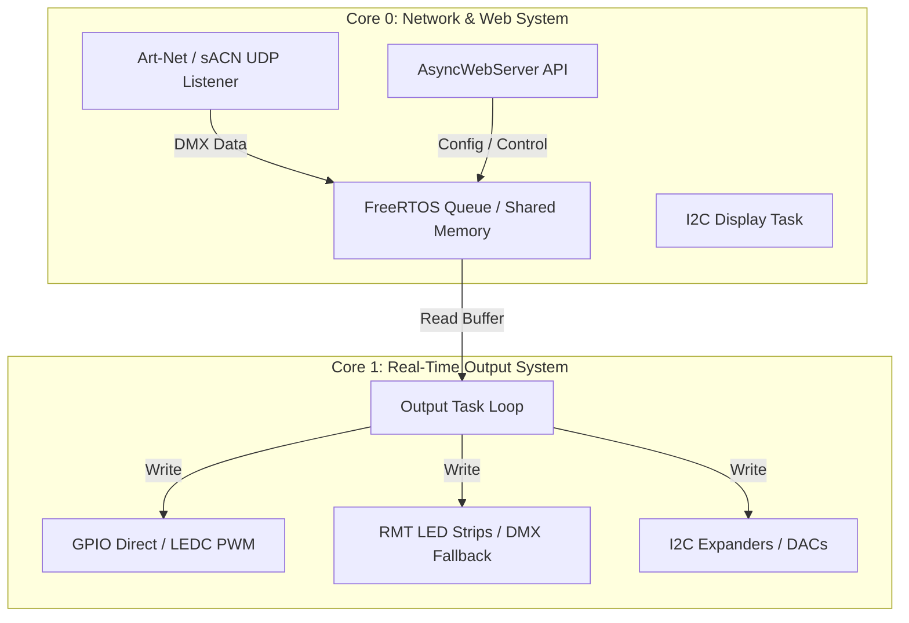
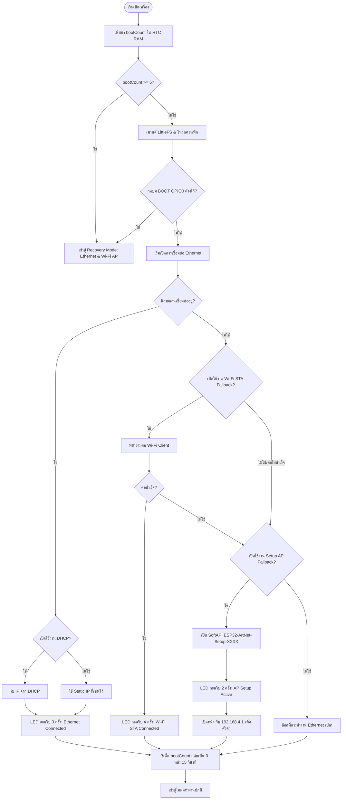

# Domain Model: ESP32 Art-Net Firmware

เอกสารนี้เป็นผลลัพธ์จาก `/grilling` แบบ domain-modeling โดยสกัดจากไฟล์เดิมของโปรเจคเป็นหลัก: `include/output_control.h`, `include/scoring.h`, `include/config.h`, `src/main.cpp`, `web/index.html`, `docs/user_manual/main.typ`, และ `docs/resource_calculator.md`.

## Core Domain

โปรเจคนี้คือ firmware สำหรับ WT32-ETH01 ที่รับ DMX data จาก Art-Net, sACN หรือ ESP-NOW แล้วแปลงเป็น output ทางกายภาพหลายชนิด เช่น LED, DMX, relay, dimmer, motor, servo, audio trigger และ smoke shooter.

แกนกลางของระบบคือ `OutputChannel` หนึ่งรายการ ซึ่งแทน output ทางกายภาพหนึ่งชุด พร้อมข้อมูล routing, DMX address, type-specific settings, runtime state และ peripheral handle ที่จำเป็น.

### Hardware Architecture

บอร์ด **WT32-ETH01** ใช้ชิปคู่ ESP32 (Dual-Core 240MHz) ร่วมกับชิปควบคุมแลน **LAN8720A Ethernet PHY** โดยมีการแบ่งงานในระดับฮาร์ดแวร์และซอฟต์แวร์ดังนี้:

- **Core 0 (Network & Control Core):** จัดการงานที่เกี่ยวข้องกับเครือข่ายทั้งหมด (Ethernet, Wi-Fi SoftAP/STA, UDP Listeners, Web Server, และหน้าจอแสดงผล I2C Display)
- **Core 1 (Real-Time Output Core):** จัดการงานประมวลผลเอาต์พุต (DMX Serial, LED strips, PWM, Stepper/Motor control) เพื่อไม่ให้สลอตเวลาการปล่อยสัญญาณจริงถูกรบกวนโดยการจราจรทางเครือข่าย



## Ubiquitous Language

| Term | Meaning | Source of Truth |
| --- | --- | --- |
| Output Channel | แถว config หนึ่งรายการที่ควบคุมอุปกรณ์หนึ่งชุด | `OutputChannel` in `include/output_control.h` |
| Output Type | ชนิดอุปกรณ์ v3 type `0..18` | `outputTypeName()` in `include/scoring.h` |
| Source | ที่มาของ pin/channel: ESP32 GPIO, PCA9685, digital expander, MCP4725 | `source` fields in `OutputChannel` |
| DMX Start Universe | universe แรกที่ channel นี้อ่านข้อมูล | `start_universe` |
| DMX Start Address | DMX address แบบ 1-based ภายใน universe | `start_address` |
| Resource Score | คะแนนทรัพยากร hardware ที่ใช้ | Contract: Configuration Contract; implementation: `estimateResources()`, `resourceScore()` |
| Compute Score | คะแนนภาระ CPU/runtime | `channelComputeScore()`, `fpsComputeFactor()` |
| Interlock | กฎป้องกัน config ที่ชนกันหรือ hardware ใช้งานไม่ได้ | `validateOutputJson()`, `validateSettingsAndOutputs()` |
| Runtime State | state ชั่วคราว เช่น smoke, solenoid, stepper command | fields in `OutputChannel` |

## Bounded Contexts

### Configuration Context

หน้าที่:
- เก็บ system settings ใน NVS `Preferences`.
- เก็บ outputs layout ใน LittleFS `/outputs.json`.
- migration config layout เป็น version 3.
- sanitize values เช่น `output_fps`.

ไฟล์หลัก:
- `include/config.h`
- `include/output_control.h`
- `src/main.cpp`

กฎสำคัญ:
- `output_fps` ต้องอยู่ในช่วง `1..44`.
- layout version ปัจจุบันคือ `3`.
- `web/index.html` เป็น source ของ UI, `include/web_pages.h` เป็นไฟล์ generated.

#### การจัดเก็บข้อมูล (Storage Strategy)

ระบบจัดเก็บการตั้งค่าออกเป็น 2 ส่วน:

**A. NVS Preferences Storage (System Config)**
- ขอบเขต: ใช้เก็บข้อมูลคอนฟิกระบบที่มีขนาดเล็ก จำเป็นต่อการเริ่มต้นเครือข่ายและการบูตเครื่องขั้นพื้นฐาน เช่น IP Address, Wi-Fi Credentials, Device Mode, I2C Speed, Display Type, Art-Net/sACN Ports
- Namespace: `"system"` ใน ESP32 Preferences Library
- วงจรชีวิต: โหลดผ่าน `loadConfig()` ทันทีเมื่อเปิดเครื่องก่อนเริ่มระบบเครือข่าย; บันทึกผ่าน `saveConfig()` เมื่อกดเซฟจาก System Settings ในหน้าเว็บ

**B. LittleFS File System (Output Layout & Routing Data)**
- ขอบเขต: ใช้สำหรับโครงสร้างข้อมูลช่องเอาต์พุตที่มีความยืดหยุ่น มีฟิลด์พารามิเตอร์จำนวนมาก หรือมีลักษณะเป็นอาร์เรย์
- ไฟล์หลัก: `/outputs.json` (output channels), `/espnow_peers.json` (ESP-NOW peer routing)
- เวอร์ชัน migration: `loadChannels()` ตรวจสอบฟิลด์ `"version"`; v1/v2 → v3 แปลง type IDs อัตโนมัติ, ข้าม output ที่ Deprecated (WiZ Bulbs); หลัง migration สำเร็จจะเขียนทับกลับเป็น v3 เสมอ

#### ระบบระบุตัวตนเครือข่าย (Network Identity & Naming)

- SSID ของ SoftAP และชื่อ mDNS Responder จะถูกต่อท้ายด้วย MAC Address 4 หลักสุดท้าย (เช่น `ESP32-ArtNet-Setup-XXXX` และ `[mdns_name]-[xxxx].local`)
- ข้อมูลชื่ออุปกรณ์ทาง ArtPollReply (Short/Long Name) จะต่อท้ายด้วย MAC Suffix (เช่น Short Name: `CHAL Node-XXXX`)
- ใน Recovery Mode mDNS จะลงทะเบียนเป็น `[mdns_name]-recovery.local` (ไม่มี MAC suffix)

#### โหมดกู้คืน (Recovery Mode)

- เข้าด้วยการบูตล้มเหลวซ้ำซ้อน 5 ครั้ง (5 consecutive resets) หรือกดปุ่ม BOOT (GPIO0) ค้างไว้ขณะเปิดเครื่อง
- จะเปิดการเชื่อมต่อแบบคู่ (Dual Network): Ethernet และ Wi-Fi AP พร้อมกัน โดย AP SSID จะเป็น `ESP32-ArtNet-Recovery-XXXX` และเปิดเป็น open AP (ไม่มีรหัสผ่าน)
- ปิดฟังก์ชันการแสดงผลเอาต์พุตและทาสก์ส่งสตรีมไฟทั้งหมดในโหมดนี้
- Async Web Server ยังคงทำงานเพื่อให้เข้าหน้าเว็บตั้งค่าและหน้า `/update` สำหรับ OTA firmware recovery
- **กลไก Consecutive Reset Counter:** ใช้ `bootCount` ใน RTC Fast Memory; เพิ่มทุกครั้งที่ boot; task `resetBootCountTask` หน่วง 15 วินาทีแล้วล้างค่า; ถ้าเกิน 5 ครั้งก่อนล้างจะเข้า Recovery Mode
- **Physical GPIO0 Trigger:** หากตรวจพบ GPIO0 เป็น LOW ใน `setup()` จะเข้า Recovery Mode โดยตรง

#### การเชื่อมต่อ Wi-Fi ใหม่แบบอัตโนมัติ (Wi-Fi Auto-Reconnection)

- ระบบพยายาม Reconnect Wi-Fi ทุกๆ 10 วินาทีเป็นอย่างน้อย (Rate-limited 10s)
- จะข้ามการพยายามเชื่อมต่อ Wi-Fi Client เสมอหากอุปกรณ์รันในโหมด Ethernet และมีสายแลนเชื่อมต่ออยู่ (`ethConnected || ETH.linkUp()`)

### Output Routing Context

หน้าที่:
- แปลง DMX bytes เป็น signal ที่เหมาะกับอุปกรณ์.
- จัดการ source หลายชนิด: GPIO, PCA9685, MCP23017, TCA9555, PCF857x, MCP4725.
- รองรับ hybrid routing สำหรับอุปกรณ์หลายขา เช่น stepper, motor, RGB/RGBW, 7-segment, smoke shooter.

ไฟล์หลัก:
- `include/output_control.h`
- `include/motion_control.h`
- `include/pca9685_control.h`
- `include/i2c_gpio_expander.h`
- `include/funcgen_control.h`
- `include/dfplayer_control.h`

กฎสำคัญ:
- STEP pin ของ stepper ต้องเป็น ESP32 GPIO.
- Motor EN ใน mode `IN1+IN2+EN` ต้องเป็น ESP32 GPIO หรือ PCA9685 เพราะต้องใช้ PWM.
- PCA9685 แชร์ frequency ต่อ chip; servo บังคับ 50 Hz.
- digital expander เหมาะกับ digital output ไม่ใช่ PWM timing.
- ทุกคำสั่งที่คุยผ่าน `Wire` (I2C) ต้องถูกคลุมด้วย `xSemaphoreTake(i2cMutex, pdMS_TO_TICKS(100))` — รวมถึง PCA9685, MCP23017, I2C DAC และการวาดหน้าจอ
- ทาสก์หน้าจอ I2C Display (Core 0) ใช้ queue เพื่อเลี่ยงการยึด I2C บ่อยเกินไป

### Protocol Input Context

หน้าที่:
- รับ DMX frame จาก Art-Net, sACN หรือ ESP-NOW.
- ทำให้ output task เห็นข้อมูลใหม่แบบ core-safe.

ไฟล์หลัก:
- `include/artnet_control.h`
- `include/sacn_control.h`
- `include/espnow_control.h`
- `src/main.cpp`

กฎสำคัญ:
- Core 0 รับ network/display/web.
- Core 1 ประมวลผล output.
- atomic flags เช่น `networkFramePending` ต้องใช้แบบปลอดภัยกับ dual-core.
- ESP-NOW callback ต้อง defer ผ่าน queue ไม่ทำงานหนักใน callback.

#### Art-Net Protocol

- รองรับ OpCodes: `0x5000` (OpDmx) สำหรับรับ DMX frames, `0x2000` (OpPoll) สำหรับค้นหาอุปกรณ์
- **ArtPollReply:** เมื่อได้รับ OpPoll จะสร้าง `ArtPollReplyPacket` ส่งกลับไปยังผู้ส่งพร้อมข้อมูล:
  - Short Name: `"CHAL Node-XXXX"`, Long Name: `"CHAL WT32-ETH01 Converter - XXXX"`
  - Node Report: `"#0001 [OK] System healthy and ready."`
  - IP/MAC Address และรายการ Universe เอาต์พุตที่กำลังใช้งาน (จำกัดสูงสุด 4 Universe ต่อ ArtPollReply)
- Universe เก็บในรูปแบบ Little-Endian; Length เก็บในรูปแบบ Big-Endian

#### sACN Protocol (ANSI E1.31)

- รองรับทั้ง Unicast และ Multicast
- **Multicast Group Registration:** คำนวณและลงทะเบียนเข้ากลุ่ม Multicast IP (`239.255.X.Y`) อัตโนมัติตาม Universe ของเอาต์พุต
- **Priority-based Source Selection:** รองรับฟังข้อมูลพร้อมกันสูงสุด 4 แหล่ง; เปรียบเทียบ sACN Priority (0-200); เลือกประมวลผลเฉพาะแหล่งที่มี priority สูงที่สุด; หากแหล่งหลักหายไปเกิน 2500 ms จะสลับไปแหล่งสำรอง

#### ESP-NOW Master

- รับ Art-Net/sACN แล้วส่งต่อ DMX ไปยัง slave ตาม peer route ที่เก็บใน `/espnow_peers.json`
- การจับคู่บอร์ด (Peering): เก็บ MAC Address และช่วง DMX Universe/Address ของปลายทาง; หาก peer list ว่างจะ Broadcast ไป `FF:FF:FF:FF:FF:FF`
- DMX Chunking: แบ่งส่งข้อมูล 1 Universe (512 channels) ในขนาดสูงสุด `ESPNOW_DMX_CHUNK_SIZE` (200 bytes data + 12 bytes header)
- ใช้ peer route ให้แคบที่สุดเพื่อลด airtime
- ESP-NOW ต้องเปิด Wi-Fi radio (`WIFI_AP_STA` เมื่อจำเป็น)
- Chunk size user-configurable (future): แยก `configured_chunk_size` สำหรับส่งออกจาก compile-time max receive buffer; slave ไม่จำเป็นต้องตั้งค่า chunk size ตรงกับ master แต่ต้อง reject packet ที่ `length` เกิน max buffer

#### ESP-NOW Slave

- รับ packet ผ่าน callback, queue ไปประมวลผลใน `outputTask`, แล้ว map ตาม universe/offset เข้าช่อง output
- Core-Safe Deferral: callback (Core 0) ดันข้อมูลเข้า FreeRTOS Queue (Queue Depth 16); Core 1 (`outputTask`) อ่านจาก queue และประมวลผล
- Always-On Setup AP: ในโหมด Slave บอร์ดจะเปิด SoftAP (SSID `ESP32-ArtNet-Setup-XXXX`) ค้างไว้ตลอดเพื่อให้เข้าตั้งค่าผ่านเว็บได้แม้ไม่มีการต่อสายแลน

#### ESP-NOW DMX Packet Structure

| Byte Range | Field Name | Data Type | Description |
| :---: | :--- | :---: | :--- |
| 0..2 | Prefix Magic | `char[3]` | ค่าคงที่ `"DMX"` เพื่อคัดกรองแพ็กเกจ |
| 3..4 | Universe | `uint16_t` | DMX Universe (0..32767) |
| 5..6 | Offset | `uint16_t` | จุดเริ่มต้นของข้อมูลใน Universe (0..511) |
| 7..8 | Total Length | `uint16_t` | ขนาดเต็มของ Universe (ปกติ 512) |
| 9..10 | Chunk Length | `uint16_t` | ขนาด DMX data ในแพ็กเกจนี้ (สูงสุด chunk_size) |
| 11 | Sequence | `uint8_t` | ตัวนับลำดับเพื่อเช็คความเสถียร |
| 12.. | DMX Payload | `uint8_t[]` | ค่า DMX แชนเนลจริง |

Peer route จำกัดช่วง universe `0..32767` และ DMX address `1..512`; slave map packet ทันทีตาม `universe`/`offset` โดยไม่ต้องรอ reassemble ยกเว้น buffer แสดงสถานะ universe 0; ถ้า peer route ยาวกว่า chunk size, master แบ่งส่งหลาย packet โดยเพิ่ม `offset` ทีละ chunk size

### Validation And Interlock Context

หน้าที่:
- ป้องกัน configuration ที่ทำให้ firmware crash, peripheral ชนกัน หรือ hardware ทำงานผิด.
- ต้อง validate ทั้งฝั่ง C++ API และ Web UI.

ไฟล์หลัก:
- `src/main.cpp`
- `web/index.html`

กฎสำคัญ:
- ห้าม GPIO duplicate.
- ห้าม output ใช้ pin เดียวกับ Status LED, Zero-Crossing, I2C SDA/SCL.
- จำกัด DFPlayer ได้สูงสุด 2 channel เพราะใช้ UART1/2.
- DFPlayer มี priority ในการจอง UART; DMX GPIO ใช้ UART ที่เหลือก่อน แล้ว fallback เป็น RMT.
- RMT รวม LED strip และ DMX fallback ต้องไม่เกิน 8.
- source ต้อง match output type.
- **GPIO12 (MTDI) Avoidance:** GPIO 12 เป็น Bootstrap Pin — ห้ามใช้งานโดยเด็ดขาด; Web UI ต้องแสดงคำเตือนหากผู้ใช้กรอก GPIO 12
- **AC Dimmer Zero-Crossing Interlock:** หาก `zc_pin == 255` (ปิดใช้งาน) AC Dimmer จะถูกล็อกให้เอาต์พุตเป็น 0 เสมอ; Web UI ต้องแสดง ZC Pin Missing Warning
- **PCA9685 Shared Frequency Conflict:** หากผสมอุปกรณ์ที่ต้องการความถี่ต่างกัน (servo 50Hz + LED >200Hz) บน PCA chip เดียวกัน → Web UI และ API แสดงคำเตือนแต่ไม่อล็อกการเซฟ
- **DMX Frame Timeout:** Core 1 loop ต้องไม่มี blocking operation ที่ทำให้ DMX Frame Cycle เกิน 50ms; บังคับตั้งค่า FPS เริ่มต้นที่ 30-40 FPS

### Capacity Scoring Context

หน้าที่:
- ประเมินความหนักของ configuration ก่อน save.
- รวม hardware resource score และ compute score.

ไฟล์หลัก:
- `include/scoring.h`
- `web/index.html`
- `docs/resource_calculator.md`

กฎสำคัญ:
- weight constants ต้องตรงกันระหว่าง C++ และ JS.
- resource scoring ต้องสะท้อน routing ที่เลือกจริง เช่น hybrid pin source, segment-level routing, และ DMX UART/RMT fallback.
- total score limit มาจาก resource max ของ WT32-ETH01 + compute budget.
- resource score ไม่แทน hard interlock ทั้งหมด; validation ยังคงต้องเช็ค peripheral limit จริง.

#### สูตรการคำนวณคะแนน (Score Formula)

```text
resourceScore = GPIO*0.5 + LEDC*2.5 + RMT*3.0 + UART*8.0 + DAC*2.0 + PCA*0.25 + EXP*0.125
computeScore  = sum(type compute cost) + (output_fps / 60) * 5
totalScore    = resourceScore + computeScore
```

- **Resource Weights:** GPIO (0.5), LEDC (2.5), RMT (3.0), UART (8.0), EXP (0.125), PCA (0.25)
- **Compute Score:** ประเมิน CPU overhead เช่น Stepper/Function Generator +2.0 ต่อช่อง, RGB LED Pixel +0.005 ต่อหลอด
- **Score Limit:** `SCORE_LIMIT ≈ 109.0` — หากเกิน Web UI และ firmware จะปฏิเสธ

#### การตรวจสอบนอกระบบ (Offline Load Calculator)

มีสคริปต์ `tools/load_calculator.py` สำหรับประเมินและตรวจสอบการทับซ้อนของพินบนคอมพิวเตอร์ก่อนนำไปใช้จริง:
- จำลอง Routing-accurate estimation ถอดรหัสขา (pin, pin2, pin3, pin4, seg_pins)
- ตรวจสอบการชนกับขาส่วนกลาง (Status LED, ZC, I2C Bus)
- รองรับโหมด Interactive หรือระบุไฟล์คอนฟิกจำลอง

---

## Device Modes

เฟิร์มแวร์รองรับ 3 โหมดหลักตามการตั้งค่าตัวแปร `sysCfg.device_mode` ใน NVS:

### Mode 0: Art-Net Ethernet Mode (`MODE_ARTNET_ETHERNET`)

ทำหน้าที่เป็น wired lighting node รับสัญญาณ DMX ผ่านสายแลน (หรือ Wi-Fi สำรอง) แล้วแปลงออกเป็นพอร์ตเอาต์พุตต่างๆ

**พอร์ตโปรโตคอล:** Art-Net UDP `6454` (ปรับได้), sACN UDP `5568` (Unicast + Multicast)
**mDNS Responder:** จดทะเบียนเป็น `[mdns_name]-[xxxx].local`

**ลำดับการเริ่มระบบ (Startup & Fallback Sequence):**



### Mode 1: ESP-NOW Master Mode (`MODE_ESPNOW_MASTER`)

ทำหน้าที่เป็นตัวรับข้อมูลไฟจากระบบเครือข่ายแลน/Wi-Fi (Art-Net หรือ sACN) แล้วแปลงส่งต่อออกไปในรูปแบบคลื่นวิทยุไร้สายความเร็วสูงด้วยโปรโตคอล ESP-NOW ไปยังบอร์ดบริวาร (Slaves)

- Peering: เก็บ MAC Address และช่วง DMX ใน `/espnow_peers.json`; หาก peer list ว่างจะ Broadcast ไป `FF:FF:FF:FF:FF:FF`
- DMX Chunking: แบ่ง 1 Universe (512 ch) สูงสุด `ESPNOW_DMX_CHUNK_SIZE` (200 bytes data + 12 bytes header)

### Mode 2: ESP-NOW Slave Mode (`MODE_ESPNOW_SLAVE`)

ทำหน้าที่รับสัญญาณแพ็กเกจ DMX ไร้สายที่ Master ส่งมาเพื่อนำมาขับเอาต์พุตทางกายภาพที่ต่ออยู่กับบอร์ด

- Core-Safe Deferral: callback (Core 0) → FreeRTOS Queue (Queue Depth 16) → Core 1 (`outputTask`) ประมวลผล
- Always-On Setup AP: SoftAP (SSID `ESP32-ArtNet-Setup-XXXX`) เปิดค้างไว้ตลอดเพื่อให้ config ภาคสนามแม้ไม่มีการต่อสายแลน

---

## Aggregates

### Device Configuration

ประกอบด้วย:
- `SystemConfig`: network, protocol, pins, display, output FPS.
- `outputs[]`: รายการ `OutputChannel`.

Invariant:
- global pins ต้องไม่ชนกันเองและไม่ชนกับ output pins.
- protocol/network settings ต้องมี fallback ที่ predictable.
- settings ที่เปลี่ยน hardware/network อาจต้อง reboot.

### Output Channel

ประกอบด้วย:
- identity โดยตำแหน่งใน outputs array.
- type/source/routing fields.
- DMX location.
- type-specific parameters.
- runtime-only state และ peripheral handles.

Invariant:
- field ที่เกี่ยวกับ source ต้องสอดคล้องกับ type.
- multi-pin output ต้องมี routing ครบตาม mode.
- runtime-only pointer/state ไม่ใช่ persisted domain data.

### Hardware Resource Budget

ประกอบด้วย:
- GPIO, LEDC, RMT, UART, DAC, PCA9685 channel, digital expander channel.
- compute budget จาก output type และ `output_fps`.

Invariant:
- RMT <= 8.
- UART usable for DMX/DFPlayer <= 2.
- LEDC <= 16.
- total combined score <= `SCORE_LIMIT`.

---

## Thread Safety & Core Architecture

### I2C Bus Synchronization (`i2cMutex`)

บอร์ด WT32-ETH01 มีพอร์ต I2C ทางกายภาพเพียงช่องเดียวซึ่งเชื่อมอุปกรณ์ทุกชิ้นเข้าด้วยกัน (Expander, DAC, Display)

**กฎเหล็ก:** ทุกคำสั่งที่คุยผ่าน `Wire` ต้องถูกคลุมด้วยระบบกั้น `i2cMutex`:

```cpp
if (xSemaphoreTake(i2cMutex, pdMS_TO_TICKS(100)) == pdTRUE) {
    // ทำการอ่านหรือเขียนค่าผ่านบัส I2C
    xSemaphoreGive(i2cMutex);
} else {
    // แจ้งเตือนข้อผิดพลาด I2C Lockup
}
```

ทาสก์หน้าจอ OLED (Core 0) ใช้ queue เพื่อเลี่ยงการยึด I2C บ่อยเกินไป

### Dynamic Config Reload Safety

เมื่อหน้าเว็บส่ง POST `/api/outputs`:
1. Validate ข้อมูลเอาต์พุต
2. เขียนเซฟลง LittleFS
3. ปิดและดีดคืนทรัพยากรเอาต์พุตเดิม → เริ่มทาสก์ใหม่บน Core 1 อย่างนุ่มนวล

### Atomic Frame Notification & Sync

ใช้ตัวแปรอะตอมิก `networkFramePending` เพื่อหลีกเลี่ยง Heavy Mutex Lock ในการซิงค์เฟรมแสง (30-40 FPS):

- **Core 0:** เมื่อ network packet ผ่าน validation และ map ลง buffer สำเร็จ → ตั้ง `networkFramePending = true`
- **Core 1:** ใน `outputTask` ตรวจสอบแฟล็กผ่าน `networkFramePending.exchange(false)` — ถ้า true → สั่ง `outputCtrl.updateLeds()` ทันที
- **ผลดี:** แยก Decoupled execution loops ระหว่าง network กับ output rendering; latency ต่ำ; Deadlock-free

### Wi-Fi Auto-Reconnection Logic

- Rate-limited ทุก 10 วินาที (ใช้ `millis()` + `lastWifiReconnectAttempt`)
- หากอุปกรณ์อยู่ใน Ethernet mode และมีสายแลนเชื่อมต่อ (`ethConnected || ETH.linkUp()`) จะข้ามการเชื่อมต่อ Wi-Fi Client โดยเจตนา

### DMX Frame Timeout Constraint

DMX Frame Cycle ต้องไม่นานเกิน 50ms (ขั้นต่ำ 20Hz) เพื่อป้องกันโคมไฟเข้าสู่ Safe-state; ระบบบังคับตั้งค่าเริ่มต้นที่ 30-40 FPS

---

## Configuration Contract

ส่วนนี้เป็น contract กลางสำหรับ `/outputs.json`, Web UI, C++ validation, runtime setup, และ scoring. ถ้า behavior จริงในโค้ดไม่ตรงกับตารางนี้ ให้ถือว่าเป็น implementation drift ที่ต้องแก้หรือบันทึกไว้ชัดเจน.

### Source IDs

| ID | Source | Contract |
| ---: | --- | --- |
| 0 | ESP32 GPIO | direct ESP32 pin; ต้องไม่ชน global pins หรือ output GPIO อื่น |
| 1 | PCA9685 | PWM-capable I2C expander; 16 channel ต่อ address; shared frequency ต่อ chip |
| 2 | MCP23017 | digital-only I2C GPIO expander |
| 3 | TCA9555 | digital-only I2C GPIO expander |
| 4 | PCF857x | digital-only I2C GPIO expander |
| 5 | I2C DAC | I2C DAC source ใช้ได้เฉพาะ output type 14; model selected by `dac_model` |

### I2C Address Contract

| Device/source | Valid addresses | Notes |
| --- | --- | --- |
| PCA9685 (`source=1`) | `0x40..0x47` | PWM/servo expander, 16 channels per chip |
| MCP23017 (`source=2`) | `0x20..0x27` | Digital GPIO expander |
| TCA9555 (`source=3`) | `0x20..0x27` | Digital GPIO expander |
| PCF857x (`source=4`) | `0x20..0x27`, `0x38..0x3F` | PCF8574 and PCF8574A address families |
| MCP4725 (`source=5`, `dac_model=0`) | `0x60`, `0x61` | Single-channel 12-bit I2C DAC |
| DAC7571 (`source=5`, `dac_model=1`) | `0x4C`, `0x4D` | Single-channel 12-bit I2C DAC; TI lists address support for up to two devices |
| DAC7573 (`source=5`, `dac_model=2`) | `0x4C..0x5B` | Quad 12-bit I2C DAC; `pca_channel` selects channel A-D (`0..3`) |
| SSD1306/SH1106 display | `0x3C`, `0x3D` | System display setting, not an output source |
| PCF8574 LCD display backpack | `0x27`, `0x3F` | System display setting, not an output source |

### Output Type Source Contract

| Type | Output | Primary source | Hybrid routing | Notes |
| ---: | --- | --- | --- | --- |
| 0 | AC Dimmer | GPIO only | none | uses shared zero-crossing input |
| 1 | DMX Output | GPIO only | runtime UART/RMT allocation | DFPlayer reserves UARTs first; DMX uses remaining UARTs, then RMT fallback |
| 2 | Relay | GPIO, PCA9685, digital expander | none | digital output; PCA allowed as on/off driver but still shares chip frequency |
| 3 | RGB/RGBW LED Strip | GPIO only | none | uses one RMT channel per strip |
| 4 | Single Color LED | GPIO or PCA9685 | none | GPIO path uses LEDC; PCA path uses one PCA channel |
| 5 | Analog RGB/RGBW | GPIO or PCA9685 per color | R/G/B/W each route independently via pin source fields | digital expanders are not valid because color channels need PWM |
| 6 | DC Motor | GPIO or PCA9685 | IN2/DIR and EN may route separately | EN in `IN1+IN2+EN` mode must be GPIO or PCA9685, not digital expander |
| 7 | Stepper | STEP GPIO only | DIR, ENABLE, and HOME may route separately | STEP timing stays on ESP32 GPIO; digital/PCA hybrid is for slower pins only |
| 8 | RC Servo | GPIO or PCA9685 | none | any servo on a PCA chip forces that chip to 50 Hz |
| 9 | Passive Buzzer | GPIO only | none | uses LEDC tone/PWM timing |
| 10 | DFPlayer MP3 | GPIO only | TX/RX GPIO pins | max 2 channels because UART1/2 only |
| 11 | 7-Segment TM1637 | GPIO only | CLK/DIO GPIO pins | TM1637 is not expander-routed; direct-drive displays use type 12/13 |
| 12 | 7-Segment DD 7-Pin PWM | GPIO or PCA9685 for Direct Dim; GPIO, PCA9685, or digital expander for No Dim/Common Dim segments | segment-level routing via `seg_*` or base routing | Direct Dim modes need PWM per segment, so MCP23017/TCA9555/PCF857x are invalid there |
| 13 | 7-Segment DD 8-Pin PWM | GPIO or PCA9685 for Direct Dim; GPIO, PCA9685, or digital expander for No Dim/Common Dim segments | segment-level routing via `seg_*` or base routing | Direct Dim modes need PWM per segment, so MCP23017/TCA9555/PCF857x are invalid there |
| 14 | DAC | I2C DAC preferred; ESP32 DAC GPIO path is legacy/unsafe on WT32-ETH01 | MCP4725/DAC7571 single-channel, DAC7573 channel A-D via `pca_channel` | GPIO25/26 are occupied by Ethernet; supported I2C DAC models are MCP4725, DAC7571, and DAC7573 |
| 15 | PWM DAC | GPIO or PCA9685 | none | GPIO path uses LEDC; supports duty calibration for external 0-10V or 4-20mA interface circuits |
| 16 | Function Generator | GPIO only | none | uses LEDC/timer-like runtime load |
| 17 | Solenoid | GPIO, PCA9685, digital expander | none | trigger/pulse state machine |
| 18 | Smoke Shooter | GPIO, PCA9685, digital expander | smoke and shoot pins route together or by pin fields | two digital outputs controlled by sequence state machine |

### Persisted Output JSON Fields

Fields expected to be persisted in `/outputs.json`:
- identity by array index, not by stable ID.
- `type`, `source`, `start_universe`, `start_address`.
- DAC model selection for I2C DAC outputs: `dac_model`; DAC7573 channel uses `pca_channel` (`0..3`).
- primary routing: `pin`, `pca_addr`, `pca_channel`.
- multi-pin routing: `pin2`, `pin3`, `pin4`, `pin2_source`, `pin3_source`, `pin4_source`, `pin2_addr`, `pin3_addr`, `pin4_addr`, `pin2_channel`, `pin3_channel`, `pin4_channel`.
- PCA contiguous/legacy routing fields: `pca_channel2`, `pca_channel3`, `pca_channel4`.
- LED fields: `led_count`, `color_order`, `led_protocol`.
- motor/servo/stepper/function/PWM fields: `mc_mode`, `mc_resolution`, `mc_freq`, `mc_deadband`, `mc_invert`, `mc_brake`, `mc_min_us`, `mc_max_us`, `mc_steps_per_rev`, `mc_homing_*`, `mc_scale_factor`, `mc_unit_type`, `mc_enable_active_high`, `mc_dir_invert`, `mc_step_invert`.
- PWM DAC calibration fields: `pwm_dac_mode` (`0=Custom`, `1=0-10V`, `2=4-20mA`), `pwm_dac_min`, `pwm_dac_max` as duty percent times 100 (`0..10000`).
- inversion fields: `pin_invert`, `pin2_invert`, `pin3_invert`, `pin4_invert`, `seg_inverts`.
- 7-segment direct-drive routing: `seg_pins`, `seg_sources`, `seg_addrs`, `seg_channels`.
- solenoid/smoke fields: `solenoid_mode`, `solenoid_threshold`, `solenoid_pulse_ms`, `solenoid_pre_delay`, `solenoid_post_delay`, `smoke_duration_ms`, `settle_delay_ms`, `shoot_duration_ms`, `smoke_lockout_ms`; Smoke Shooter reuses `solenoid_threshold` as its trigger threshold.
- network-like output fields if used by a type: `dest_ip`, `dest_port`.

Fields that must not be treated as persisted domain config:
- runtime buffers and handles: `dmxBuffer`, `bufferSize`, `pixelStrip`, `dmxPort`, `rmtDmx`, `dfPlayer`, `funcGen`.
- transient state: `smoke_state`, `smoke_timer`, `smoke_prev_trigger`, `prev_7seg_val`, `prev_7seg_valid`, `stepper_cmd_state`, `stepper_cmd_start_time`, `stepper_homing_start_time`, `solenoid_pulse_start`, `solenoid_pulse_active`, `solenoid_last_trigger`.
- allocated LEDC bookkeeping: `ledc_chan2`, `ledc_chan3`, `ledc_chan4`.

### Validation Gates

Configuration must pass these gates before save/apply:
- type ID must be `0..18`.
- source must match the output type source contract above.
- global pins must not overlap each other: Status LED, Zero-Crossing, I2C SDA, I2C SCL.
- any output GPIO, including hybrid GPIO pins and segment GPIO pins, must not overlap global pins.
- output GPIO pins must not duplicate across outputs.
- expander channels must not duplicate for the same source/address/channel.
- every I2C-routed output address must be inside the valid range for that device/source/model.
- display I2C address must match the selected display type: OLED `0x3C/0x3D`, PCF8574 LCD `0x27/0x3F`.
- DFPlayer count must be `<= 2`.
- RMT use from LED strips plus DMX fallback must be `<= 8`.
- LEDC use must be `<= 16`.
- 7-segment Type 12/13 Direct Dim modes (`mc_mode` 4/5) must route segments to ESP32 GPIO or PCA9685, not digital expanders.
- PCA9685 shared frequency conflicts must be surfaced; servo forces 50 Hz per chip.
- combined score must be `<= SCORE_LIMIT`.

### Scoring Contract

Resource Score must be routing-accurate:
- Count GPIO only for actual ESP32 GPIO-routed pins.
- Count LEDC only for GPIO-routed PWM outputs that actually consume LEDC.
- Count RMT for LED strips and DMX outputs that fall back after UART allocation.
- Count UART after DFPlayer priority allocation; DFPlayer consumes UART before DMX.
- Count PCA9685 channels for actual PCA-routed channels.
- Count digital expander channels for actual digital expander-routed channels.
- Count Type 12/13 per segment using `seg_sources`, `seg_pins`, `seg_channels`, or base routing rules; Direct Dim modes can only score GPIO/LEDC or PCA segment routes because digital expanders are invalid.
- Compute Score is separate from Resource Score and includes per-type runtime cost plus `output_fps` factor.

Known implementation drift to fix later:
- C++ `totalOutputScoreFromJson()` may not copy every routing field needed for routing-accurate scoring.
- Web UI `channelScore()` still has stale assumptions for some types and must be audited against this contract.
- Web UI `channelScore()` uses global `outputs` for DMX/DFPlayer allocation even when scoring a candidate `newOutputs` array.
- Web UI reserved-pin validation may miss hybrid GPIO pins when the primary source is not GPIO.
- Web UI hardware warning counters are separate from score and may still use simplified counting.

---

## Architectural Decisions (ADRs)

### ADR001: Function Generator Frequency & Resolution Limitation
- **Rationale:** เฟรมเรต Art-Net/DMX (30-44 FPS) เพียงพอสำหรับสายตามนุษย์
- **Decision:** Function Generator (Type 16) เช่น Sine, Triangle เป็นฟังก์ชันเสริมสำหรับ Educational/Simulation; ไม่แนะนำให้รันความถี่สูงในงานจริง; จำกัด timer interrupt ขั้นต่ำไว้ที่ 50µs

### ADR002: Motor & Motion Control Separation
- **Rationale:** อุปกรณ์มอเตอร์ที่ต้องการความละเอียดสูง (Micro-stepping, Camera rotation) เป็นภาระหนักและอาจสร้างสัญญาณรบกวนข้ามคอร์
- **Decision:** แนะนำให้ใช้ ESP32 นี้ส่ง DMX ไปควบคุม Dedicated Motor Controller Board แทนการขับกำลังสูงโดยตรง

### ADR003: DMX Frame Timeout Constraint
- **Rationale:** DMX Decoders บางประเภทเข้าสู่ Safe-state หากเว้นว่างเกิน 50ms
- **Decision:** Core 1 loop ต้องไม่มี blocking operation ที่ทำให้ DMX Frame Cycle เกิน 50ms; บังคับตั้งค่า FPS เริ่มต้นที่ 30-40 FPS

### ADR004: I2C Display Recovery & Non-blocking Strategy
- **Rationale:** จอ I2C อาจหลุดชั่วคราว แต่การ Blocking I2C ACK จะดึงเวลาเอาต์พุตโปรโตคอล
- **Decision:** (1) สแกนบัส I2C เป็นระยะเพื่อ Auto-reinit (2) Non-blocking/Minimum Wait I2C write (3) อนุญาตให้ Disable Display ผ่าน Web UI

### ADR005: Low Latency Direct Update & Hold Last State
- **Rationale:** ความหน่วงในระบบไฟเวทีคือสำคัญที่สุด; Frame Interpolation เพิ่ม Buffer Lag
- **Decision:** (1) Slave อัปเดตแบบ "รับแล้วแสดงทันที" (2) หากไร้สายขาด — Hold Last State (3) Frame Interpolation เป็นแผนระยะยาวสำหรับเอาต์พุตทางกลเท่านั้น

### ADR006: WT32-ETH01 GPIO 12 (MTDI) Avoidance Policy
- **Rationale:** GPIO 12 เป็น Bootstrap Pin; การดึง High ขณะบูตทำให้ Boot Loop ถาวร
- **Decision:** (1) ห้ามใช้งาน GPIO 12 ทุกกรณี (2) Web UI ต้องแสดง Warning Banner หากผู้ใช้กรอก GPIO 12

### ADR007: PCA9685 Shared Frequency Compromise Policy
- **Rationale:** PCA9685 ใช้ความถี่ PWM ร่วมกัน 16 ช่อง; servo (50Hz) + LED (>200Hz) ต่างความถี่
- **Decision:** (1) แต่ละ I2C Address ตั้งค่าความถี่แยกอิสระ (0x40-0x47) (2) หากผสมอุปกรณ์ต่างความถี่บนบอร์ดเดียวกัน → Warning (ไม่บล็อกการเซฟ)

### ADR008: Internal GPIO DAC Blocking (WT32-ETH01)
- **Rationale:** GPIO 25/26 (Internal DAC) ชนกับ LAN8720A Ethernet PHY
- **Decision:** (1) ปิด/ซ่อน Source 0 (GPIO) สำหรับ DAC Type 14 บน WT32-ETH01; ผลักดันให้ใช้ I2C DAC เสมอ (2) เก็บโค้ด `dacWrite()` ไว้เพื่อความเข้ากันได้กับบอร์ดอื่น

### ADR009: ESP-NOW Slave Wi-Fi Channel Selection Policy
- **Rationale:** ESP-NOW ต้องการ Master และ Slave อยู่บนช่อง Wi-Fi เดียวกัน
- **Decision:** (1) Fix Channel Mode: ผู้ใช้กำหนดเลขช่องใน Web UI Slave (2) Auto Channel Mode: Slave สแกนหาแพ็กเกจ DMX Signature จาก MAC Master แล้วล็อกช่องอัตโนมัติ

### ADR010: In-field Hardware Adaptability & Switch Inversion Policy
- **Rationale:** Homing switches ในหน้างานเป็นได้ทั้ง NO และ NC
- **Decision:** เปิดเผย `pin_invert`, `pin4_invert` ใน Web UI; ให้ผู้ใช้ปรับ `val ^ inv` ใน `readOutputPin()` ได้ตามประเภทสวิตช์

### ADR011: DMX Resource Scoring Parity Drift (C++ vs JS) — Known
- **Rationale:** JS คำนวณ DMX Fallback → RMT (3.0) แบบ Dynamic; C++ ประเมินแบบ Worst-case UART (8.0)
- **Decision:** (1) C++ เป็น Worst-case static estimation (ป้องกันการจองเกิน) (2) Runtime allocation แยกจาก logic scoring (3) บันทึกเป็น Known Drift เพื่อปรับปรุงภายหลัง

### ADR012: Planned Independent Art-Net Enablement Option
- **Rationale:** ใน network ที่สตรีม Art-Net เยอะ ผู้ใช้อาจต้องการปิด Art-Net เพื่อป้องกันทับซ้อน
- **Decision:** (อนาคต) เพิ่ม `artnet_enabled` (bool) ใน NVS `SystemConfig` และ UI checkbox; Core 0 ควบคุม `artNetCtrl.loop()` ตามค่านี้; หากปิดทั้ง Art-Net และ sACN → validation error ป้องกันบอร์ดตัดขาดจากแสงไฟ

---

## Grilling Results

คำถามที่ใช้ grill และคำตอบที่ infer จากโค้ดเดิม:

| Question | Answer from existing files | Consequence |
| --- | --- | --- |
| อะไรคือ entity หลักของระบบ? | `OutputChannel` | เอกสาร/validation ควรอ้างอิง channel เป็นศูนย์กลาง |
| ข้อมูลไหนเป็น persisted config และข้อมูลไหนเป็น runtime state? | `OutputChannel` รวมทั้งสองกลุ่มไว้ใน struct เดียว | ต้องระวังเวลาเพิ่ม field ใหม่ว่า save/load หรือ runtime-only |
| capacity คุมด้วยจำนวน channel หรือ resource score? | user manual บอก up to 16, code comment บอก no hard channel limit และใช้ score/hardware validation | เอกสาร resource เดิมที่เขียน max 8 ต้องแก้ |
| source compatibility อยู่ที่ไหน? | C++ validation และ Web UI validation | การเพิ่ม output/source ต้องแก้สองฝั่ง |
| score เป็น hard safety ทั้งหมดไหม? | ไม่ใช่, ยังมี UART/RMT/GPIO/PCA/I2C interlock | ห้ามลด validation เหลือแค่ score |
| Web UI source of truth อยู่ที่ไหน? | `web/index.html`; `include/web_pages.h` generated | แก้ UI ต้อง regenerate web pages |
| ความเสี่ยงหลักในการ refactor คืออะไร? | struct ใหญ่, routing hybrid, validation duplicated JS/C++ | ควร refactor แบบเล็กและมี build/test ทุกครั้ง |

## Current Tidy-Up Decisions

1. เอกสาร domain model นี้เป็น reference กลางของคำศัพท์และ invariant.
2. `docs/resource_calculator.md` ต้องสะท้อน v3 current firmware ไม่ใช่รายการ output ที่ถูกยกเลิกหรือยังไม่มีใน type `0..18`.
3. ยังไม่แยก `OutputChannel` ในโค้ด เพราะมีความเสี่ยงสูงต่อ save/load, Web UI JSON และ runtime pointer ownership.
4. การปรับปรุงโค้ดในอนาคตควรเริ่มจาก helper validation หรือ shared constants ที่ลด drift ระหว่าง C++/JS โดยไม่เปลี่ยน layout ก่อน.

## Open Risks

| Risk | Why It Matters | Mitigation |
| --- | --- | --- |
| C++/JS validation drift | ผู้ใช้อาจ save ผ่าน UI ไม่ได้ หรือ API รับ config ที่ UI ไม่รับ | เพิ่ม checklist ทุกครั้งที่แก้ output type/source |
| `OutputChannel` รวม persisted/runtime state | เพิ่ม field ผิดที่อาจทำให้ migration หรือ memory lifecycle พัง | document field group ก่อน refactor |
| Generated web file stale | firmware อาจ embed UI เก่า | run `python tools/build_web.py` หลังแก้ `web/index.html` |
| Hardware docs drift | ผู้ใช้ต่อวงจรผิดหรือเลือก pin ผิด | ใช้ `docs/domain_model.md` และ `docs/resource_calculator.md` เป็นคู่กัน |
| Resource scoring drift | C++/JS score อาจรับ config หนักเกินจริงหรือ reject config ที่ควรผ่าน | เมื่อแก้ routing field ต้อง sync `include/scoring.h` และ `web/index.html` ให้ routing-accurate |
| Current scoring implementation drift | domain rule ต้องการ routing-accurate score แต่บาง C++ JSON scoring path ยังอาจ copy routing fields ไม่ครบ | audit/fix `totalOutputScoreFromJson()` และเทียบกับ JS `channelScore()` |
