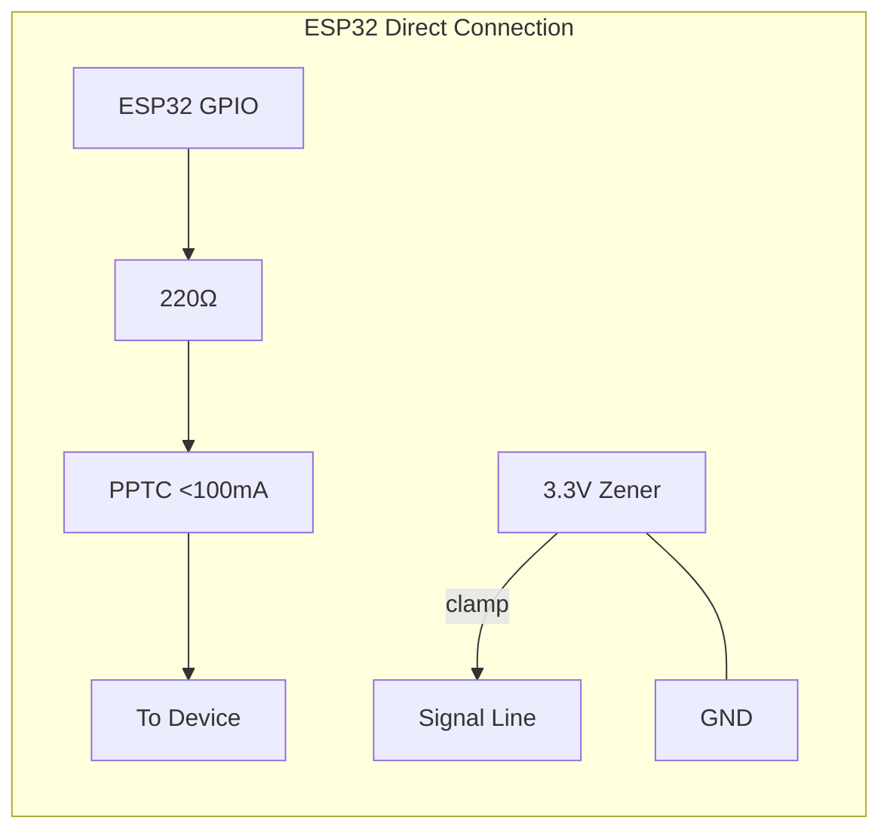
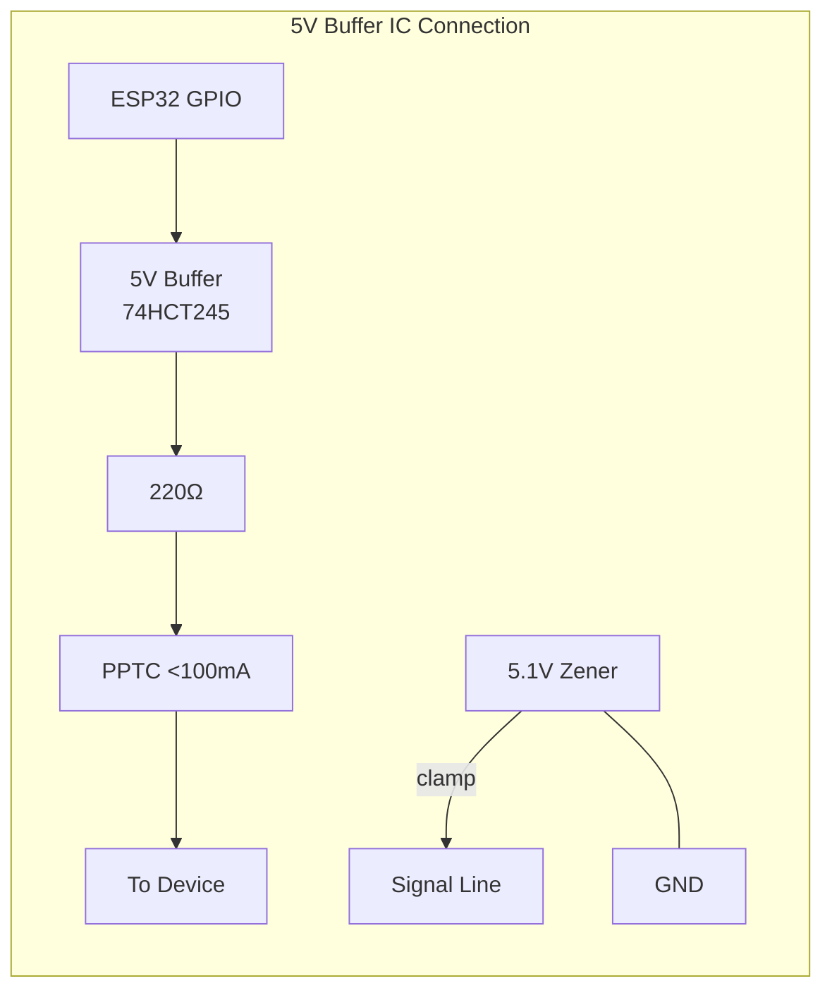
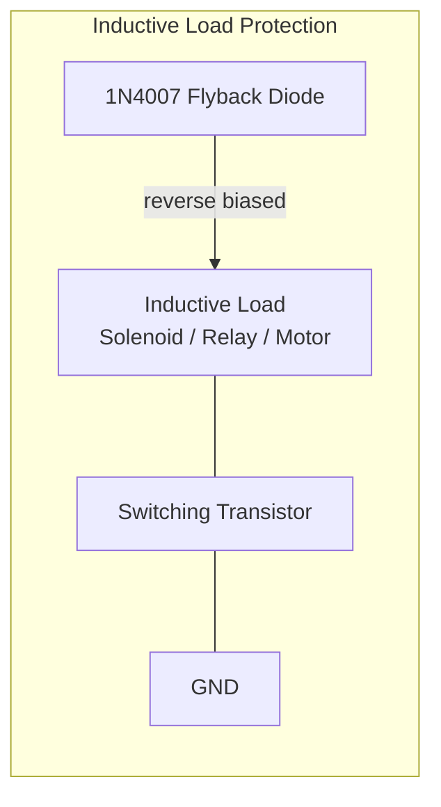
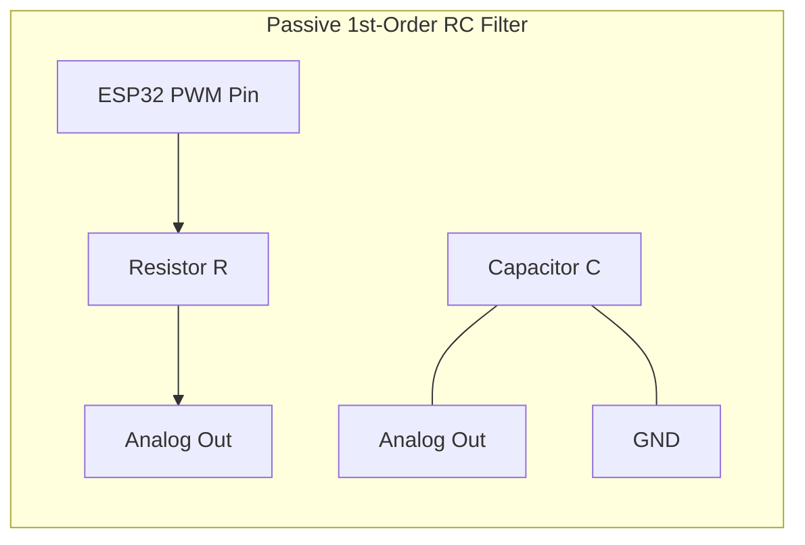
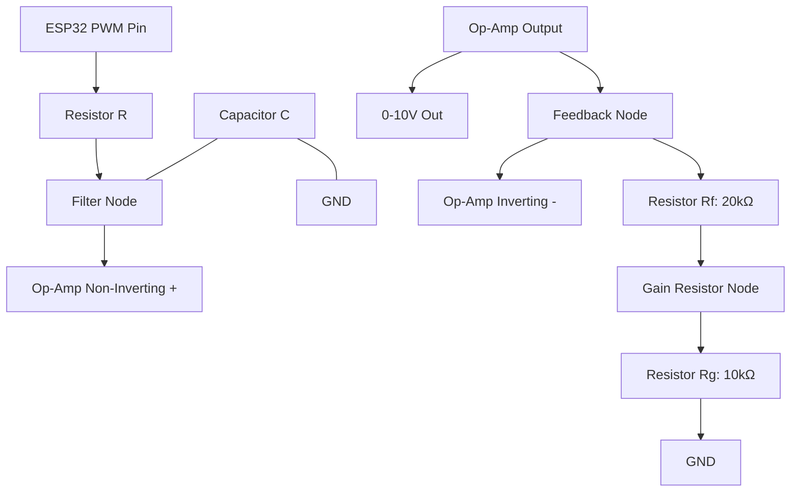
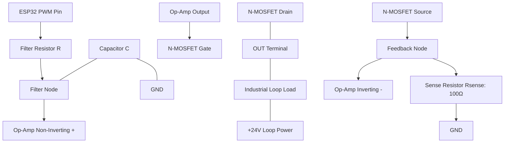

# Hardware Protection & Verification Guidelines: ESP32 Art-Net Firmware

This document describes the hardware protection circuit design guidelines for output ports on the WT32-ETH01 board, including datasheet verification plans for all external devices used with this firmware.

---

## 1. Output Port ESD & Overcurrent Protection

When the board drives various loads for lighting and effect control in the field, current surges or noise feedback can cause brownout resets or port damage. The following protection circuits are recommended:

### 1.1 Schematic Options

**Case 1: Direct Connection from ESP32 GPIO (No Buffer IC)**
Use a 3.3V Zener Diode to prevent the ESP32 signal pin voltage from exceeding the 3.3V rating.

```text
[ESP32 GPIO Pin] ────┬─── [ R: 220 Ohm ] ─── [ PPTC: < 100 mA ] ─── [ OUT TO DEVICE ]
                      │
                [ Zener: 3.3V ]
                      │
                    [GND]
```



**Case 2: Connection via 5V Buffer IC (e.g., 74HCT245 or 5V-level)**
Use a 5.1V Zener Diode (e.g., `PDZVTR5.1B`) on the buffer's output side.

```text
[ESP32 GPIO] ──> [5V Buffer IC] ────┬─── [ R: 220 Ohm ] ─── [ PPTC: < 100 mA ] ─── [ OUT TO DEVICE ]
                                      │
                                [ Zener: 5.1V ]
                                      │
                                    [GND]
```



### 1.2 Component Details & Protection

- **Zener Diode (ESD Clamp):** Connected before the current-limiting resistor to clamp excess voltage (Voltage Clamping), protecting against ESD or reverse voltage.
  - Use **5.1V Zener** (e.g., `PDZVTR5.1B`): Only when a 5V buffer IC is present between ESP32 and the external device.
  - Use **3.3V Zener**: Required when connecting directly to ESP32 GPIO to prevent pin voltage exceeding 3.3V.
- **Series Resistor:** A `220 Ohm` resistor in series on the signal line limits maximum current and protects the pin.
- **PPTC Resettable Fuse:** A resettable fuse in series on the output line, **limiting operating current to under 100 mA** for signal-level output safety.

### 1.3 Inductive Load Protection (Flyback Diode)

**Problem:** Inductive loads (Solenoid valves, Relay coils, DC Motors) generate a high reverse voltage spike (Flyback Voltage) when suddenly switched off, which can disrupt the radio system or damage the driving transistor.

**Mitigation:** **Always connect a fast or general-purpose diode (e.g., 1N4007) in reverse-biased parallel across the inductive load** to safely discharge the reverse voltage to ground and prevent brownout resets from voltage spikes.



### 1.4 PWM DAC & Function Generator Low-Pass Filter

To convert high-frequency PWM outputs into smooth analog DC voltages (for PWM DAC mode) or analog waveforms (for Function Generator mode), an external Resistor-Capacitor (RC) Low-Pass Filter (LPF) is required.

#### 1.4.1 Passive 1st-Order RC Filter

The simplest way to filter a PWM signal is using a passive Resistor-Capacitor (RC) filter:

```text
                  R
[ESP32 PWM] ───[Resistor]───┬─── [Filtered Analog Out]
                            │
                       [Capacitor C]
                            │
                          [GND]
```



**Cutoff Frequency Formula:**
$$f_{\text{cutoff}} = \frac{1}{2 \pi R C}$$

**Component Selection Guidelines:**
Depending on the output mode, the cutoff frequency ($f_{\text{cutoff}}$) must be chosen to balance ripple attenuation against signal responsiveness/bandwidth:

1. **PWM DAC Mode (0-10V or DC Level Control):**
   - **Goal:** Minimize voltage ripple; slow response times (tens of milliseconds) are acceptable.
   - **Recommended Cutoff:** $1.6 \text{ Hz}$ to $16 \text{ Hz}$.
   - **Recommended Values:** $R = 10\text{ k}\Omega$, $C = 1\mu\text{F}$ ($f_{\text{cutoff}} \approx 16 \text{ Hz}$) or $C = 10\mu\text{F}$ ($f_{\text{cutoff}} \approx 1.6 \text{ Hz}$).
   - **Note:** This filters out the PWM carrier frequency extremely well, leaving a clean, stable DC voltage.

2. **Function Generator Mode (Type 16 Waveforms up to 5 kHz):**
   - **Goal:** Pass the maximum generated signal frequency (up to 5 kHz) with minimal attenuation, while filtering the 50 kHz carrier frequency.
   - **Recommended Cutoff:** $7 \text{ kHz}$ to $10 \text{ kHz}$.
   - **Recommended Values:** $R = 2.2\text{ k}\Omega$, $C = 10\text{ nF}$ ($f_{\text{cutoff}} \approx 7.2 \text{ kHz}$).
   - **Note:** The carrier frequency ($50 \text{ kHz}$) is attenuated by $\approx 17\text{ dB}$, while signals up to $5 \text{ kHz}$ pass with minimal phase shift and amplitude drop. For a cleaner waveform, a 2nd-order RC filter can be used.

#### 1.4.2 Active 0-10V Buffer/Amplifier (LM358)

Because passive RC filters have high output impedance, connecting them directly to low-impedance loads will cause voltage drops. Additionally, to scale the ESP32's 3.3V logic level to a standard industrial 0-10V signal, an active Op-Amp buffer with gain is recommended.

```text
                  R
[ESP32 PWM] ───[Resistor]───┬─── [Op-Amp (+)] ────── [ LM358 / TL072 ] ─── [ 0-10V Out ]
                            │          │                                        │
                       [Capacitor C]   └──── [Op-Amp (-)] ───┬─── [ Rf: 20k ] ──┘
                            │                                │
                          [GND]                        [ Rg: 10k ]
                                                             │
                                                           [GND]
```



- **Power Supply:** The Op-Amp must be powered by a $+12\text{V}$ (or higher) VCC rail to allow outputting a full $+10\text{V}$ (LM358 requires at least $V_{\text{out}} + 1.5\text{V}$ headroom, so $+12\text{V}$ to $+24\text{V}$ is ideal).
- **Gain Calculation:** $\text{Gain} = 1 + \frac{R_f}{R_g} = 1 + \frac{20\text{ k}\Omega}{10\text{ k}\Omega} = 3.0$ (Input $3.3\text{V} \times 3.0 = 9.9\text{V}$ maximum output).
  - To achieve exactly $10.0\text{V}$, replace $R_f$ with a $20\text{ k}\Omega$ multi-turn potentiometer in series with a $5\text{ k}\Omega$ resistor to calibrate the top end.

#### 1.4.3 Active 0-5V and 0-24V Buffer/Amplifier (LM358)

To output other standard industrial voltage ranges like 0-5V or 0-24V from the ESP32's 3.3V PWM output, the same non-inverting amplifier topology can be used by modifying the feedback resistor values ($R_f$ and $R_g$) and adjusting the supply voltage (VCC) of the Op-Amp:

1. **0-5V Analog Output:**
   - **Gain Required:** $\text{Gain} = \frac{5.0\text{V}}{3.3\text{V}} \approx 1.515$
   - **Feedback Resistors:** $R_g = 10\text{ k}\Omega$, $R_f = 5.1\text{ k}\Omega$ (provides a gain of $1 + \frac{5.1}{10} = 1.51$, giving an output of $\approx 4.98\text{V}$).
   - **Power Supply (VCC):** Minimum $+7\text{V}$ (to allow for the LM358's $1.5\text{V}$ output headroom). $+12\text{V}$ is recommended.

2. **0-24V Analog Output:**
   - **Gain Required:** $\text{Gain} = \frac{24.0\text{V}}{3.3\text{V}} \approx 7.27$
   - **Feedback Resistors:** $R_g = 10\text{ k}\Omega$, $R_f = 62\text{ k}\Omega$ (provides a gain of $1 + \frac{62}{10} = 7.20$, giving an output of $\approx 23.76\text{V}$). For exactly $24\text{V}$, replace $R_f$ with a $50\text{ k}\Omega$ trimmer in series with a $47\text{ k}\Omega$ resistor.
   - **Power Supply (VCC):** Minimum $+26\text{V}$ (to allow a full $+24\text{V}$ output with $2\text{V}$ headroom).

---

#### 1.4.4 Active 4-20mA Current Loop Transmitter

Industrial 4-20mA signals are current-driven to prevent signal degradation over long wire runs. A simple active voltage-to-current converter (Current Sink) can be constructed using an Op-Amp and a power N-MOSFET (or NPN Darlington transistor like TIP122) in the feedback loop:

```text
                                                     [ +24V Loop Power ]
                                                              │
                                                        [ Loop Load ]
                                                              │
                                                        [ OUT Terminal ]
                                                              │
                                                          D ┌─┴─┐
                       ┌─────────┐                ┌────────>│   │ N-MOSFET (e.g., 2N7000 / IRF540)
                  R    │      (+)├────────────────┤       G │   │
  [ESP32 PWM] ───[R]───┼─┬───────│                │         └─┬─┘
                       │ │    (-)├────────────────┼───────────┤ S
                       │ └───────┘                │           │
                       │   LM358                  │         [ Rsense: 100 Ohm ]
                      [C]                         │           │
                       │                          │         [ GND ]
                     [GND]                        └─────────── (Feedback to op-amp inverting input)
```



**Operating Principle:**
1. The RC filter smooths the ESP32's PWM signal into a clean DC input voltage $V_{\text{in}}$ at the non-inverting input (+).
2. The Op-Amp drives the MOSFET gate until the voltage at the source ($V_{\text{source}}$) matches $V_{\text{in}}$.
3. The current through the loop is determined by $I_{\text{out}} = \frac{V_{\text{in}}}{R_{\text{sense}}}$.
4. With $R_{\text{sense}} = 100\text{ }\Omega$:
   - $V_{\text{in}} = 0.4\text{V} \implies I_{\text{out}} = \frac{0.4\text{V}}{100\text{ }\Omega} = 4\text{ mA}$
   - $V_{\text{in}} = 2.0\text{V} \implies I_{\text{out}} = \frac{2.0\text{V}}{100\text{ }\Omega} = 20\text{ mA}$

**Software Calibration Setup:**
Instead of building complex offset-shifting analog hardware, software mapping is used to define the 4-20mA range on the 0-3.3V PWM output. In the Web UI, configure the PWM DAC (Type 15) settings:
* **`pwm_dac_min` (Min Duty):** Set to `1212` (12.12% duty cycle $\approx 0.4\text{V}$). This maps DMX value `0` to $4\text{ mA}$.
* **`pwm_dac_max` (Max Duty):** Set to `6060` (60.60% duty cycle $\approx 2.0\text{V}$). This maps DMX value `255` to $20\text{ mA}$.

---

### 1.5 GPIO12 / MTDI Bootstrap Pin Field Use

GPIO12 is the ESP32 MTDI bootstrap pin. It is exposed on WT32-ETH01 headers and may be used by existing field hardware, but it is a boot-risk pin, not a normal safe default output.

GPIO12 policy:

- GPIO12 is **allowed with warning only** in the Web UI; it is not hard-blocked so existing installations can keep working.
- New wiring should prefer GPIO2, GPIO4, GPIO14, GPIO15, GPIO17, GPIO32, or GPIO33.
- GPIO12 must read **LOW or high-impedance** during reset and power-up. Do not add a pull-up to GPIO12.
- A HIGH level on GPIO12 during boot can select the wrong flash voltage and prevent the ESP32 from starting.

Required wiring rules when GPIO12 is used:

- Add an external pull-down near the WT32-ETH01 side. Start with **10 kOhm to GND**; use **4.7 kOhm** if the connected module has leakage or a weak pull-up.
- Keep the driven device input high-impedance during board reset. If the external module powers up before the ESP32, its input must still not source current into GPIO12.
- Add a **220 Ohm to 1 kOhm series resistor** between GPIO12 and the external driver input to limit current during reset, ESD events, or accidental contention.
- Never connect GPIO12 directly to a module input that has a fixed pull-up to 3.3V/5V, an optocoupler LED tied to VCC, or an active-high relay input that defaults HIGH.
- If the external circuit needs active-high logic, use a buffer/driver stage whose input is held LOW at startup and whose output side drives the load after boot.

Recommended buffer patterns:

```text
Safe direct logic input:

GPIO12 -- 220R..1k -- Driver Input
   |
  10k
   |
  GND
```

```text
Safer active-high load driver:

GPIO12 -- 1k -- N-MOSFET / NPN input stage -- Load driver input
   |
  10k
   |
  GND

Load power and ESP32 GND must be common. Add flyback diode for coils.
```

Mode-specific guidance:

| Use case | GPIO12 suitability | Required notes |
| --- | --- | --- |
| Relay / solenoid / smoke digital output | Acceptable with caution | Prefer low-side transistor/MOSFET driver. Add pull-down on GPIO12 and flyback diode on coils. Avoid relay modules whose input is pulled HIGH at boot. |
| Single LED / PWM DAC / analog PWM | Acceptable with caution | Use pull-down plus series resistor. External RC/filter input must not pull GPIO12 HIGH. Prefer another GPIO for precision analog/PWM if available. |
| Servo signal | Not recommended | Many servo/level-shifter boards can inject noise or pull the signal line. Use another GPIO or PCA9685 where possible. |
| Stepper STEP / high-speed timing | Not recommended | Bootstrap risk plus timing sensitivity. Use another GPIO for STEP. DIR/ENABLE can be moved to expanders if needed. |
| I2C SDA/SCL | Not recommended | I2C pull-ups intentionally pull the line HIGH, which is unsafe for GPIO12 at boot unless isolated. Use GPIO14/GPIO15 defaults instead. |
| Status LED | Acceptable only if LOW at boot | LED circuit must not pull GPIO12 HIGH. Use GPIO5 default or GPIO17 if possible. |
| Zero-cross input / input-only sensing | Avoid unless verified | Sensor output must be open-drain/open-collector or high-impedance at boot with pull-down keeping GPIO12 LOW. |

Validation checklist before deploying GPIO12 wiring:

- Power-cycle the board with the external module connected at least 10 times and confirm it always boots.
- Measure GPIO12 during reset with a multimeter or oscilloscope; it must stay below logic HIGH threshold until boot completes.
- Test both power orders: ESP32 first, external module first, and simultaneous power-up.
- Confirm failure behavior: if the external module is unplugged, GPIO12 should still be pulled LOW by the local pull-down.

---

## 2. Target Device Specs

All external peripheral devices must have reference Datasheets for driver code verification:

| # | Device | Bus | Purpose |
| ---: | --- | --- | --- |
| 1 | **PCA9685** | I2C | 16-channel PWM controller; verify register map and frequency limits |
| 2 | **MCP23017 / TCA9555** | I2C | 16-bit I/O Expander; verify IODIR and output bitmap writes |
| 3 | **PCF8574** | I2C | 8-bit I/O Expander; verify quasi-bidirectional I/O and Active-Low behavior |
| 4 | **MCP4725 / DAC7571 / DAC7573** | I2C | 12-bit DACs; verify byte-level commands and I2C address configuration |
| 5 | **TM1637** | GPIO bit-bang | 7-Segment LED Driver; verify CLK/DIO timing constraints |
| 6 | **DFPlayer Mini / YX5200** | UART | Audio Player; verify board specs and command packet format (9600 bps) |
| 7 | **LAN8720A** | RMII | Ethernet PHY; verify bootstrap pins and 50MHz RMII Clock GPIO impact |
| 8 | **SSD1306 / SH1106** | I2C | OLED Display; verify I2C address and initialization sequence |

### 2.1 Storage & Infrastructure

- Create a folder for official PDF Datasheets at `docs/datasheets/`
- Place User Manuals for pre-built modules in the same folder
- Maintain backup download links in the reference system

### 2.2 Verification Checklist

#### 2.2.1 I2C Bus Speed Compatibility

Check the I2C Clock Speed tolerance for each chip:

| Device | Max I2C Speed |
| --- | --- |
| PCA9685 | 1 MHz (Fast-mode Plus) |
| MCP23017 | 400 kHz (Fast-mode) |
| PCF8574 | 100 kHz (Standard-mode) — some compatible devices can run at 400 kHz |

**Runtime Rule:** The overall bus speed (`sysCfg.i2c_speed`) must not exceed the maximum supported by the slowest device on the bus, to avoid bus lockup or data corruption.

#### 2.2.2 Logic Level Tolerances

- ESP32 operates at 3.3V logic levels; many relay modules and output drivers operate at 5V.
- Verify from the datasheet whether the 5V device accepts a 3.3V input signal as logic HIGH (e.g., $V_{IH} \le 2.0\text{V}$), or whether a logic level shifter is required.

#### 2.2.3 Timing & Start-up Delays

- Check the power-on reset / boot time for each IC.
- Some expander chips require a settling delay before accepting the first command, to prevent startup configuration errors.

---

## 3. Calibration & Verification Guidelines

Budget calibration against the real board can be performed via three tests:

1. **Jitter & Latency Test:** Configure outputs near the CPU budget limit at 40 FPS, send Art-Net, and measure output frame timing with an oscilloscope or logic analyzer. If frames drop or jitter, the CPU budget safety reserve or `ModeCost.flags` dynamic/background estimates are too loose.
2. **I2C Bus Contention Test:** Measure round-trip time for expander writes on the shared I2C bus. If cumulative write time exceeds 15-20 ms, the per-route I2C write estimate is too low, causing I2C bus saturation.
3. **RAM Heap Monitoring:** Ensure free RAM stays above 30-40 KB under heavy load, to maintain stability for OTA and network data transfer.

---

## 4. Reference Document Storage Policy

- **Location:** `docs/datasheets/` — store official PDF Datasheets for all devices.
- **Naming:** `<device_name>_<revision>_<datasheet|manual>.pdf` (e.g., `PCA9685_v5_datasheet.pdf`)
- **Updates:** Every time a new device driver is added, attach the Datasheet or a reference link.
- **Backup Links:** Store download URLs from manufacturer websites in `docs/datasheets/LINKS.md`.
