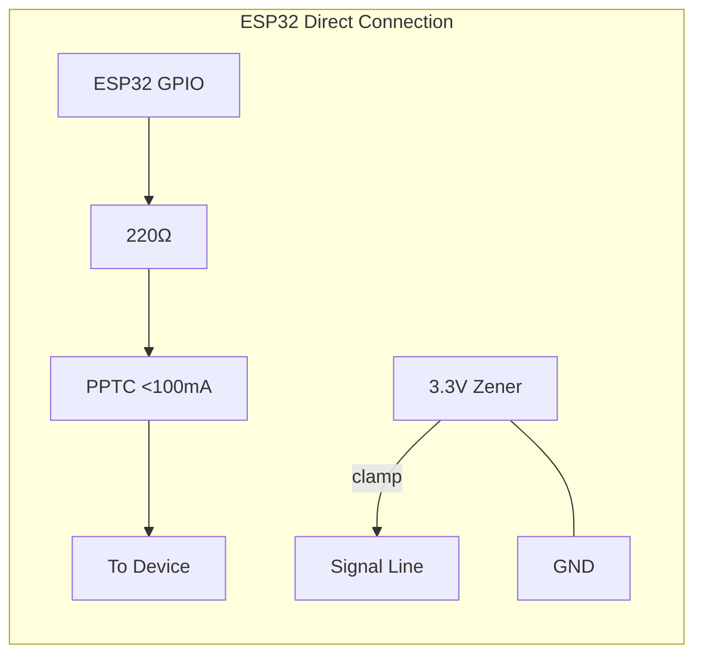
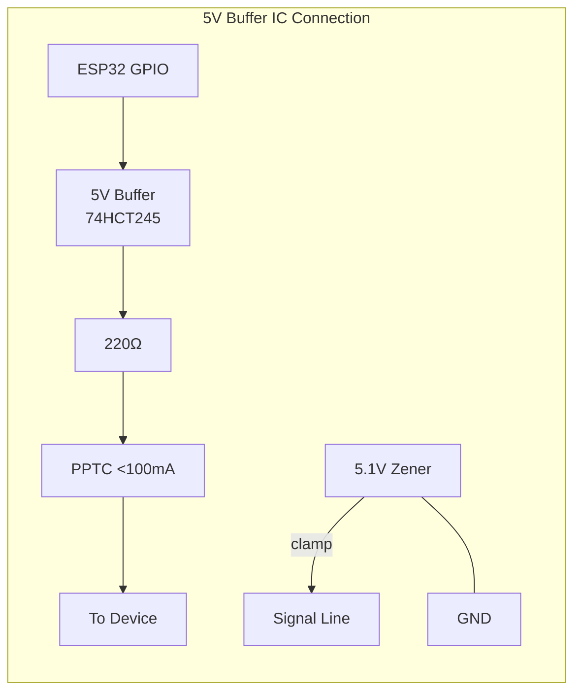
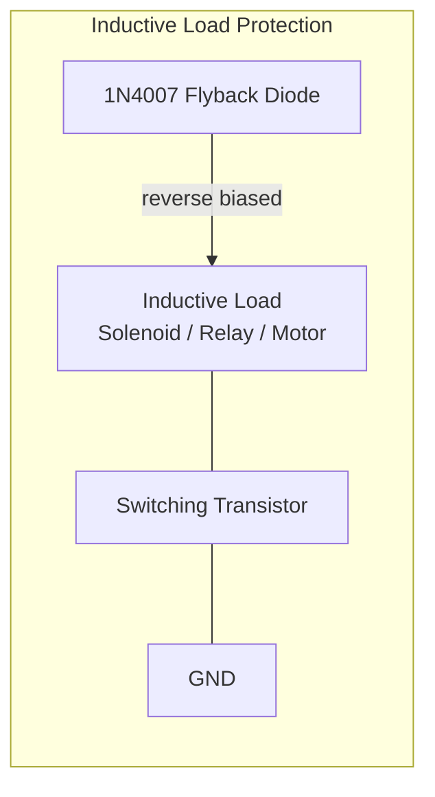

# Hardware Protection & Verification Guidelines: ESP32 Art-Net Firmware

This document describes the hardware protection circuit design guidelines for output ports on the WT32-ETH01 board, including datasheet verification plans for all external devices used with this firmware.

---

## 1. Output Port ESD & Overcurrent Protection

When the board drives various loads for lighting and effect control in the field, current surges or noise feedback can cause brownout resets or port damage. The following protection circuits are recommended:

### 1.1 Schematic Options

**Case 1: Direct Connection from ESP32 GPIO (No Buffer IC)**
Use a 3.3V Zener Diode to prevent the ESP32 signal pin voltage from exceeding the 3.3V rating.

```text
[ESP32 GPIO Pin] ────┬─── [ R: 220 Ohm ] ─── [ PPTC: < 100 mA ] ─── [ OUT TO DEVICE ]
                      │
                [ Zener: 3.3V ]
                      │
                    [GND]
```



**Case 2: Connection via 5V Buffer IC (e.g., 74HCT245 or 5V-level)**
Use a 5.1V Zener Diode (e.g., `PDZVTR5.1B`) on the buffer's output side.

```text
[ESP32 GPIO] ──> [5V Buffer IC] ────┬─── [ R: 220 Ohm ] ─── [ PPTC: < 100 mA ] ─── [ OUT TO DEVICE ]
                                      │
                                [ Zener: 5.1V ]
                                      │
                                    [GND]
```



### 1.2 Component Details & Protection

- **Zener Diode (ESD Clamp):** Connected before the current-limiting resistor to clamp excess voltage (Voltage Clamping), protecting against ESD or reverse voltage.
  - Use **5.1V Zener** (e.g., `PDZVTR5.1B`): Only when a 5V buffer IC is present between ESP32 and the external device.
  - Use **3.3V Zener**: Required when connecting directly to ESP32 GPIO to prevent pin voltage exceeding 3.3V.
- **Series Resistor:** A `220 Ohm` resistor in series on the signal line limits maximum current and protects the pin.
- **PPTC Resettable Fuse:** A resettable fuse in series on the output line, **limiting operating current to under 100 mA** for signal-level output safety.

### 1.3 Inductive Load Protection (Flyback Diode)

**Problem:** Inductive loads (Solenoid valves, Relay coils, DC Motors) generate a high reverse voltage spike (Flyback Voltage) when suddenly switched off, which can disrupt the radio system or damage the driving transistor.

**Mitigation:** **Always connect a fast or general-purpose diode (e.g., 1N4007) in reverse-biased parallel across the inductive load** to safely discharge the reverse voltage to ground and prevent brownout resets from voltage spikes.



### 1.4 GPIO12 / MTDI Bootstrap Pin Field Use

GPIO12 is the ESP32 MTDI bootstrap pin. It is exposed on WT32-ETH01 headers and may be used by existing field hardware, but it is a boot-risk pin, not a normal safe default output.

Rules for GPIO12:

- GPIO12 is **allowed with warning only** in the Web UI; it is not hard-blocked so existing installations can keep working.
- Do not connect circuits that pull GPIO12 HIGH during reset or power-up. A HIGH level during boot can select the wrong flash voltage and prevent the ESP32 from starting.
- Prefer GPIO2, GPIO4, GPIO14, GPIO15, GPIO17, GPIO32, or GPIO33 for new output wiring.
- If GPIO12 must be used, add a defined external pull-down or ensure the connected driver input is high-impedance/LOW during boot.
- Avoid active-high relay boards, optocouplers, or level shifters on GPIO12 unless their input is guaranteed LOW at startup.

---

## 2. Target Device Specs

All external peripheral devices must have reference Datasheets for driver code verification:

| # | Device | Bus | Purpose |
| ---: | --- | --- | --- |
| 1 | **PCA9685** | I2C | 16-channel PWM controller; verify register map and frequency limits |
| 2 | **MCP23017 / TCA9555** | I2C | 16-bit I/O Expander; verify IODIR and output bitmap writes |
| 3 | **PCF8574** | I2C | 8-bit I/O Expander; verify quasi-bidirectional I/O and Active-Low behavior |
| 4 | **MCP4725 / DAC7571 / DAC7573** | I2C | 12-bit DACs; verify byte-level commands and I2C address configuration |
| 5 | **TM1637** | GPIO bit-bang | 7-Segment LED Driver; verify CLK/DIO timing constraints |
| 6 | **DFPlayer Mini / YX5200** | UART | Audio Player; verify board specs and command packet format (9600 bps) |
| 7 | **LAN8720A** | RMII | Ethernet PHY; verify bootstrap pins and 50MHz RMII Clock GPIO impact |
| 8 | **SSD1306 / SH1106** | I2C | OLED Display; verify I2C address and initialization sequence |

### 2.1 Storage & Infrastructure

- Create a folder for official PDF Datasheets at `docs/datasheets/`
- Place User Manuals for pre-built modules in the same folder
- Maintain backup download links in the reference system

### 2.2 Verification Checklist

#### 2.2.1 I2C Bus Speed Compatibility

Check the I2C Clock Speed tolerance for each chip:

| Device | Max I2C Speed |
| --- | --- |
| PCA9685 | 1 MHz (Fast-mode Plus) |
| MCP23017 | 400 kHz (Fast-mode) |
| PCF8574 | 100 kHz (Standard-mode) — some compatible devices can run at 400 kHz |

**Runtime Rule:** The overall bus speed (`sysCfg.i2c_speed`) must not exceed the maximum supported by the slowest device on the bus, to avoid bus lockup or data corruption.

#### 2.2.2 Logic Level Tolerances

- ESP32 operates at 3.3V logic levels; many relay modules and output drivers operate at 5V.
- Verify from the datasheet whether the 5V device accepts a 3.3V input signal as logic HIGH (e.g., $V_{IH} \le 2.0\text{V}$), or whether a logic level shifter is required.

#### 2.2.3 Timing & Start-up Delays

- Check the power-on reset / boot time for each IC.
- Some expander chips require a settling delay before accepting the first command, to prevent startup configuration errors.

---

## 3. Calibration & Verification Guidelines

Score calibration against the real board can be performed via three tests:

1. **Jitter & Latency Test:** Configure outputs near full capacity (score 100-109), send Art-Net at 40 FPS, and measure output frame timing with an oscilloscope or logic analyzer. If frames drop or jitter, the score ceiling or compute weights are too loose.
2. **I2C Bus Contention Test:** Measure round-trip time for expander writes on the shared I2C bus. If cumulative write time exceeds 15-20 ms, the PCA/Expander weight is too low, causing I2C bus saturation.
3. **RAM Heap Monitoring:** Ensure free RAM stays above 30-40 KB under heavy load, to maintain stability for OTA and network data transfer.

---

## 4. Reference Document Storage Policy

- **Location:** `docs/datasheets/` — store official PDF Datasheets for all devices.
- **Naming:** `<device_name>_<revision>_<datasheet|manual>.pdf` (e.g., `PCA9685_v5_datasheet.pdf`)
- **Updates:** Every time a new device driver is added, attach the Datasheet or a reference link.
- **Backup Links:** Store download URLs from manufacturer websites in `docs/datasheets/LINKS.md`.
