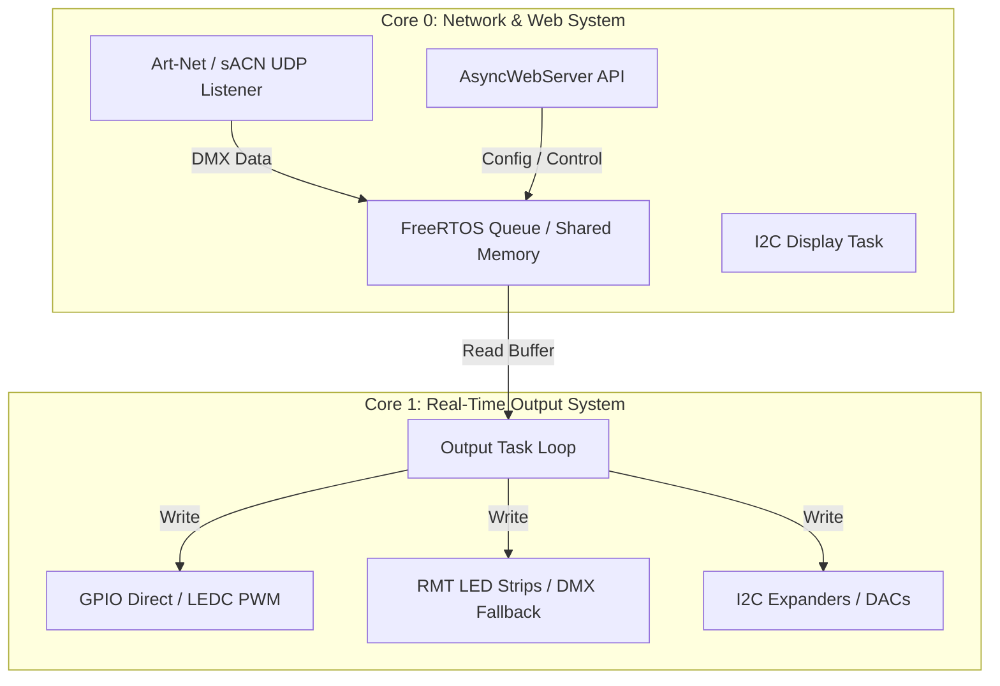
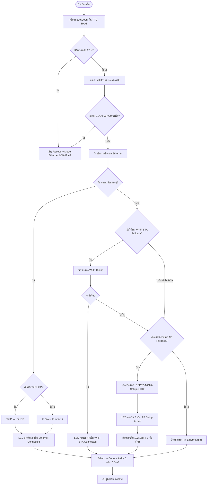

# System Context & Architecture: ESP32 Art-Net Firmware

เอกสารนี้อธิบายสถาปัตยกรรมระบบ โหมดการทำงานพื้นฐาน และโครงสร้างการทำงานภายในเฟิร์มแวร์ WT32-ETH01 Art-Net/sACN Node เพื่อเป็นข้อมูลอ้างอิงเชิงลึกสำหรับนักพัฒนา

---

## 1. Overview & Hardware Architecture

บอร์ด **WT32-ETH01** ใช้ชิปคู่ ESP32 (Dual-Core 240MHz) ร่วมกับชิปควบคุมแลน **LAN8720A Ethernet PHY** โดยมีการแบ่งงานในระดับฮาร์ดแวร์และซอฟต์แวร์ดังนี้:

*   **Core 0 (Network & Control Core):** จัดการงานที่เกี่ยวข้องกับเครือข่ายทั้งหมด (Ethernet, Wi-Fi SoftAP/STA, UDP Listeners, Web Server, และหน้าจอแสดงผล I2C Display)
*   **Core 1 (Real-Time Output Core):** จัดการงานประมวลผลเอาต์พุต (DMX Serial, LED strips, PWM, Stepper/Motor control) เพื่อไม่ให้สลอตเวลาการปล่อยสัญญาณจริงถูกรบกวนโดยการจราจรทางเครือข่าย



---

## 2. โหมดการทำงานพื้นฐาน (Basic Device Modes)

เฟิร์มแวร์รองรับ 3 โหมดหลักตามการตั้งค่าตัวแปร `sysCfg.device_mode` ใน NVS:

### โหมดที่ 0: Art-Net Ethernet Mode (`MODE_ARTNET_ETHERNET`)
ทำหน้าที่เป็น wired lighting node รับสัญญาณ DMX ผ่านสายแลน (หรือเครือข่าย Wi-Fi สำรอง) แล้วแปลงออกเป็นพอร์ตเอาต์พุตต่างๆ
*   **พอร์ตโปรโตคอล:** 
    *   **Art-Net:** ฟังบนพอร์ต UDP `6454` (ปรับเปลี่ยนได้)
    *   **sACN (E1.31):** ฟังบนพอร์ต UDP `5568` รองรับทั้ง Unicast และ Multicast (สามารถเปิดใช้งานร่วมกันได้)
*   **ระบบระบุชื่อโดเมนท้องถิ่น (mDNS Responder):** ในโหมดปกติ ระบบจะเริ่มทำงาน mDNS Responder โดยจดทะเบียนชื่ออุปกรณ์ในระบบเน็ตเวิร์กเป็นรูปแบบ **`[mdns_name]-[xxxx].local`** (เช่น `artnet-eeff.local` โดย `xxxx` คือ MAC Address 4 ตัวท้ายแบบตัวอักษรเล็ก) เพื่ออำนวยความสะดวกในการเปิดหน้าเว็บตั้งค่าโดยไม่จำเป็นต้องจดจำไอพีแอดเดรสของบอร์ดแต่ละตัวในไซต์งาน
*   **ลำดับการเริ่มระบบและการเยียวยาข้อผิดพลาด (Startup & Fallback Sequence):**
    เมื่อเปิดเครื่อง ระบบจะดำเนินการตรวจสอบและเปิดการเชื่อมต่อตามลำดับความสำคัญเพื่อความยืดหยุ่นในภาคสนาม:



*   **รายละเอียดการทำงานของโปรโตคอล (Protocol Implementation Details):**

    #### 1. การทำงานของระบบ Art-Net (Art-Net Core Logic)
    *   **OpCodes ที่รองรับ:**
        *   `0x5000` (OpDmx): รับข้อมูลเฟรมแสง DMX จากคอนโทรลเลอร์เพื่อส่งต่อลงบัฟเฟอร์เอาต์พุตหรือส่งผ่าน ESP-NOW
        *   `0x2000` (OpPoll): ตอบรับคำสั่งค้นหาอุปกรณ์เครือข่ายของโปรแกรมควบคุม
    *   **ระบบค้นหาอุปกรณ์ (ArtPollReply):** เมื่อได้รับแพ็กเกจค้นหาอุปกรณ์ (OpPoll) บอร์ดจะสร้างแพ็กเกจ `ArtPollReplyPacket` ส่งกลับไปยังเครื่องส่งเพื่อรายงานข้อมูล:
        *   ชื่ออุปกรณ์ (Short Name: "CHAL Node-XXXX", Long Name: "CHAL WT32-ETH01 Converter - XXXX" โดยที่ XXXX คือตัวอักษร MAC Address 4 ตัวสุดท้าย)
        *   สถานะสุขภาพของระบบ (Node Report: "#0001 [OK] System healthy and ready.")
        *   หมายเลข IP/MAC Address
        *   รายการ Universe เอาต์พุตที่กำลังมีช่องสัญญาณใช้งานอยู่ (จำกัดสูงสุด 4 Universe ตามโครงสร้างพื้นฐานของหนึ่งพอร์ตฟิสิคัล ArtPollReply เพื่อป้องกันความล่าช้าในการตอบกลับ)
    *   **การถอดรหัสข้อมูล:** ตัวแปร Universe จะเก็บในรูปแบบ Little-Endian (Low-byte first) ส่วนตัวแปรความยาวข้อมูล (Length) จะเก็บในรูปแบบ Big-Endian (High-byte first)

    #### 2. การทำงานของระบบ sACN (sACN Core Logic - ANSI E1.31)
    *   **การจัดการ Multicast กลุ่มเครือข่าย:** ในตอนเริ่มระบบทำงาน หากเปิดโหมด Multicast เฟิร์มแวร์จะคำนวณและทำการลงทะเบียนเพื่อเข้าร่วมกลุ่ม Multicast IP ทันที (`239.255.X.Y` โดยที่ `X` และ `Y` เป็นไบต์สูง/ต่ำของหมายเลข Universe ที่ตั้งค่าไว้ของเอาต์พุตนั้นๆ) เพื่อให้อุปกรณ์เน็ตเวิร์กสวิตช์สามารถส่งต่อแพ็กเกจเฉพาะพอร์ตที่ต้องการ (สอดคล้องกับระบบ IGMP Snooping)
    *   **ระบบสลับแหล่งข้อมูลตามลำดับความสำคัญ (Priority-based Source Selection):**
        *   ระบบรองรับการฟังข้อมูลพร้อมกันสูงสุด 4 แหล่งข้อมูล (4 Sources) โดยเก็บสถานะของแต่ละแหล่งส่ง (CID, Priority, Last Seen)
        *   หากมีโปรแกรมส่งค่า DMX เข้ามายัง Universe เดียวกันมากกว่าหนึ่งโปรแกรม ระบบจะเปรียบเทียบค่า **sACN Priority (0-200)** โดยจะเลือกประมวลผลข้อมูลจากโปรแกรมที่มีลำดับความสำคัญสูงที่สุดเท่านั้น
        *   หากแหล่งส่งหลักที่มีลำดับความสำคัญสูงสุดขาดการเชื่อมต่อ (หายไปเกิน `2500 ms`) แหล่งส่งสำรองที่มีลำดับความสำคัญรองลงมาจะถูกหยิบมาอัปเดตขับเอาต์พุตโดยอัตโนมัติ

---

### โหมดที่ 1: ESP-NOW Master Mode (`MODE_ESPNOW_MASTER`)
ทำหน้าที่เป็นตัวรับข้อมูลไฟจากระบบเครือข่ายแลน/Wi-Fi (Art-Net หรือ sACN) แล้วแปลงส่งต่อออกไปในรูปแบบคลื่นวิทยุไร้สายความเร็วสูงด้วยโปรโตคอล **ESP-NOW** ไปยังบอร์ดบริวาร (Slaves)
*   **การจับคู่บอร์ด (Peering):**
    *   เก็บรายการ MAC Address และช่วง DMX Universe/Address ของปลายทางในไฟล์ `/espnow_peers.json` บน LittleFS
    *   หากไม่มีการระบุปลายทาง (รายการ peer ว่าง) Master จะเข้าสู่โหมด **Broadcast** ส่งข้อมูลออกไปที่ MAC `FF:FF:FF:FF:FF:FF` เป็นค่าเริ่มต้น
*   **การแบ่งข้อมูลย่อย (DMX Chunking):**
    *   ข้อมูล 1 Universe (512 แชนเนล) มีขนาดใหญ่เกินขนาดข้อมูลสูงสุดของ ESP-NOW Packet (250 ไบต์)
    *   ระบบจึงทำการหั่นส่งในขนาดสูงสุด `ESPNOW_DMX_CHUNK_SIZE = 200` ไบต์ (เพิ่ม Custom Header อีก 12 ไบต์ รวมเป็น 212 ไบต์บนคลื่นวิทยุ)
    *   หากผู้ใช้จัดเส้นทาง (Peer Route) ยาวเกินขนาด Chunk ระบบจะแบ่งแพ็กเกจส่งต่อเนื่องกันโดยระบุพารามิเตอร์ `offset` เพื่อให้ Slave ประกอบข้อมูลได้อย่างถูกต้อง
*   **โครงสร้างของ Custom ESP-NOW DMX Packet:**
    
    | Byte Range | Field Name | Data Type | Description |
    | :---: | :--- | :---: | :--- |
    | 0 .. 2 | Prefix Magic | `char[3]` | ค่าคงที่ `"DMX"` เพื่อคัดกรองแพ็กเกจ |
    | 3 .. 4 | Universe | `uint16_t` | หมายเลข DMX Universe (0 .. 32767) |
    | 5 .. 6 | Offset | `uint16_t` | จุดเริ่มต้นของข้อมูลใน Universe นั้น (0 .. 511) |
    | 7 .. 8 | Total Length | `uint16_t` | ขนาดเต็มของ Universe (ปกติคือ 512) |
    | 9 .. 10 | Chunk Length | `uint16_t` | ขนาดของข้อมูล DMX ในแพ็กเกจนี้ (สูงสุด 200) |
    | 11 | Sequence | `uint8_t` | ตัวนับลำดับการส่งข้อมูลเพื่อเช็คความเสถียร |
    | 12 .. | DMX Payload | `uint8_t[]` | ค่า DMX แชนเนลจริง |

---

### โหมดที่ 2: ESP-NOW Slave Mode (`MODE_ESPNOW_SLAVE`)
ทำหน้าที่รับสัญญาณแพ็กเกจ DMX ไร้สายที่ Master ส่งมาเพื่อนำมาขับเอาต์พุตทางกายภาพที่ต่ออยู่กับบอร์ด
*   **ความปลอดภัยข้าม Core (Core-Safe Deferral):**
    *   เมื่อตัวแปลงวิทยุรับแพ็กเกจ ESP-NOW สำเร็จ ฟังก์ชัน callback จะถูกทริกเกอร์บน **Core 0** (ซึ่งเป็น System thread ห้ามทำงานช้าหรือดึงเวลา)
    *   เพื่อป้องกันปัญหาระบบแฮงก์ Callback จะนำข้อมูลที่รับได้ไปดันเข้า **FreeRTOS Queue (Queue Depth 16)** ทันที
    *   **Core 1** (`outputTask`) จะเป็นผู้นำข้อมูลออกจากคิว มาประมวลผลถอดรหัสตาม Universe และ Offset แล้วส่งเข้าบัฟเฟอร์ของ `OutputChannel` แต่ละตัวเพื่อแสดงผล
*   **การคงสถานะโหมดตั้งค่า (Always-On Setup AP):**
    *   ในโหมด Slave บอร์ดจะสั่งเปิด SoftAP (SSID ในรูปแบบ 'ESP32-ArtNet-Setup-XXXX') สำหรับเข้าตั้งค่าผ่านเว็บ (`http://192.168.4.1`) ค้างไว้ตลอดเวลา
    *   การออกแบบนี้ช่วยให้นักพัฒนายังสามารถเข้าถึงหน้าเว็บเพื่อตรวจสอบหรือแก้ไขการสัญจรพินเอาต์ได้สะดวกขณะติดตั้งอุปกรณ์จริงในงานภาคสนาม แม้ไม่มีการต่อสายแลน

---

## 3. สถาปัตยกรรมระดับ Thread และความปลอดภัยของข้อมูล

เนื่องจากระบบมีการรันงานแบบมัลติทาสก์แบบแบ่ง Core (Core 0 และ Core 1) ลอจิกความปลอดภัยของข้อมูล (Thread Safety) จึงถูกควบคุมอย่างเข้มงวด:

### A. I2C Bus Synchronization (`i2cMutex`)
บอร์ด WT32-ETH01 มีพอร์ต I2C ทางกายภาพเพียงช่องเดียวซึ่งเชื่อมอุปกรณ์ทุกชิ้นบนบอร์ดเข้าด้วยกัน (รวมถึง Expander, I2C DAC และ Display)
*   **กฎเหล็ก:** ทุกคำสั่งที่คุยผ่าน `Wire` (เช่นการเขียน PCA9685, MCP23017 หรือการวาดหน้าจอแสดงผล) จะต้องถูกคลุมด้วยระบบกั้น `i2cMutex`
*   **ลอจิกการเข้าคิว:**
    ```cpp
    if (xSemaphoreTake(i2cMutex, pdMS_TO_TICKS(100)) == pdTRUE) {
        // ทำการอ่านหรือเขียนค่าผ่านบัส I2C
        xSemaphoreGive(i2cMutex);
    } else {
        // แจ้งเตือนข้อผิดพลาด I2C Lockup
    }
    ```
*   **การปะทะกันกับทาสก์แสดงผล:** ทาสก์หน้าจอ OLED (รันบน Core 0) จะใช้วิธีรับข้อมูลหน้าจอที่ต้องการวาดผ่านคิว เพื่อเลี่ยงการเข้ายึด I2C บ่อยเกินไป และมีรอบการวาดที่ความละเอียดต่ำเพื่อรักษาแบนด์วิดท์ I2C ไว้ให้กับเอาต์พุตที่มีความสำคัญสูงบน Core 1

### B. dynamic config reload safety
เมื่อหน้าเว็บส่งคำสั่ง POST บันทึกการเปลี่ยนแปลงช่องเอาต์พุต (`/api/outputs`) ระบบ C++ จะดำเนินการดังนี้:
1.  ทำการ Validate ข้อมูลเอาต์พุตผ่านฟังก์ชันหลักทางกฎความปลอดภัย
2.  ทำการเขียนเซฟลง LittleFS ในรูปแบบ JSON
3.  **Core-Safe Apply:** ระบบจะปิดการทำงานและดีดคืนทรัพยากรเอาต์พุตเดิมทั้งหมด จากนั้นจึงเริ่มทาสก์การสลับพินใหม่บน Core 1 ซึ่งขั้นตอนนี้จะใช้เวลาชั่วครู่และจะทำการตัดและต่อสัญญาณชิปอย่างนุ่มนวล

### C. การส่งสัญญาณเตือนข้อมูลใหม่ระดับอะตอม (Atomic Frame Notification & Sync)
เพื่อหลีกเลี่ยงการใช้กลไกการล็อกที่หน่วงเวลา (Heavy Mutex Lock) ในการซิงค์ข้อมูลเฟรมแสงซึ่งเกิดขึ้นบ่อยครั้งมาก (30-40 เฟรมต่อวินาที) ระบบใช้ตัวแปรแบบอะตอมิกในการสื่อสารความปลอดภัยระหว่าง Core 0 และ Core 1:
*   **ฝั่งรับข้อมูลเครือข่าย (Core 0):** เมื่อแพ็กเกจเครือข่ายได้รับการตรวจสอบความปลอดภัยและแมปข้อมูลลงบัฟเฟอร์เอาต์พุตสำเร็จ จะทำการเขียนแฟล็กอะตอมิกเป็นจริง: `networkFramePending = true`
*   **ฝั่งเรนเดอร์เอาต์พุต (Core 1):** ในลูปเรนเดอร์ (`outputTask`) จะทำการตรวจเช็คแฟล็กอย่างรวดเร็วผ่านคำสั่งที่ไม่บล็อกทาสก์: `networkFramePending.exchange(false)`. หากค่าคืนกลับมาเป็นจริง ระบบจะสั่ง `outputCtrl.updateLeds()` เพื่อแปลงข้อมูลออกไปยังพินเอาต์พุตทางกายภาพทันที
*   **ผลดีต่อระบบ:** ช่วยแยกขอบเขตการรันงาน (Decoupled execution loops) ระหว่างระบบรับส่งแพ็กเกจเครือข่ายกับระบบควบคุมเอาต์พุตไฟอย่างสมบูรณ์แบบ มีระดับความหน่วงในการซิงค์ข้อมูลไฟต่ำสุด และตัดโอกาสการเกิดปัญหาชนกันของบัฟเฟอร์จนระบบหยุดนิ่ง (Deadlock)

### D. กลไกการเชื่อมต่อ Wi-Fi ใหม่แบบอัตโนมัติ (Automatic Wi-Fi Reconnection Logic)
ในกรณีที่เปิดใช้งาน Wi-Fi (ทั้งในโหมด STA Normal หรือ AP Setup/Recovery) เพื่อคงความเสถียรในการสื่อสาร เฟิร์มแวร์จะมีกลไกตรวจสอบและเชื่อมต่อ Wi-Fi ใหม่เมื่อหลุดโดยอัตโนมัติผ่านฟังก์ชัน `reconnectWiFiClient()` ในทาสก์หลักของ Core 0:
*   **อัตราการจำกัดความถี่การเชื่อมต่อ (Rate Limiting Retry):** เพื่อป้องกันไม่ให้การเชื่อมต่อ Wi-Fi ที่ล้มเหลวดึงทรัพยากรการประมวลผลเครือข่ายหลัก ระบบจะจำกัดการหน่วงเวลาการพยายามเชื่อมต่อใหม่ (Retry Period) ไว้อย่างน้อยทุกๆ 10 วินาที โดยจะใช้ตัวแปรอ้างอิงเวลา `millis()` ร่วมกับ `lastWifiReconnectAttempt`
*   **ลำดับความสำคัญของสายแลน (Ethernet Priority Bypass):** หากอุปกรณ์อยู่ในโหมด Ethernet (`MODE_ARTNET_ETHERNET`) และตรวจพบว่าสายแลนกำลังเชื่อมต่อหรือพร้อมทำงานอยู่ (`ethConnected || ETH.linkUp()`) ระบบจะข้ามขั้นตอนการเชื่อมต่อ Wi-Fi Client นี้ไปโดยเจตนา เพื่อลดสัญญาณรบกวนในช่องสัญญาณเครือข่ายไร้สาย และรักษาประสิทธิภาพการไหลของข้อมูล DMX ผ่านสายแลนที่เป็นตัวเลือกคุณภาพสูงกว่า

---

## 4. โครงสร้างไฟล์และสถาปัตยกรรมซอฟต์แวร์

โครงสร้างส่วนหัว (Headers) และลอจิกระดับล่างแบ่งประเภทอย่างชัดเจน:

*   [config.h](file:///c:/Users/natta/Documents/bar_program/esp32_eth01_artnet_device/include/config.h): โครงสร้างคอนฟิกระดับระบบ สั่งโหลด/บันทึกผ่าน NVS Preferences
*   [output_control.h](file:///c:/Users/natta/Documents/bar_program/esp32_eth01_artnet_device/include/output_control.h): นิยามโครงสร้าง `OutputChannel` และระบบเรนเดอร์/แมปข้อมูลเอาต์พุตหลัก
*   [motion_control.h](file:///c:/Users/natta/Documents/bar_program/esp32_eth01_artnet_device/include/motion_control.h): ประมวลผลลูปควบคุมความเร็ว/ตำแหน่งสำหรับมอเตอร์ เซอร์โว ตัวยิงควัน และเอาต์พุตทางกล
*   [scoring.h](file:///c:/Users/natta/Documents/bar_program/esp32_eth01_artnet_device/include/scoring.h): คำนวณขีดจำกัดความสามารถในการประมวลผลและการใช้พลังงานในระดับซอฟต์แวร์
*   [load_calculator.py](file:///c:/Users/natta/Documents/bar_program/esp32_eth01_artnet_device/tools/load_calculator.py): สคริปต์วิเคราะห์และคำนวณภาระทรัพยากรแบบออฟไลน์ (Offline Resource & Load Calculator) สำหรับรันจำลองการจัดสรรทรัพยากรบนคอมพิวเตอร์เพื่อความปลอดภัย

---

## 5. การตัดสินใจเชิงวิศวกรรมและการออกแบบ (Architectural Decisions - ADR)

เพื่อรักษาเสถียรภาพสูงสุดของระบบเครือข่ายแลน (Ethernet) และป้องกันการสูญเสียแพ็กเกจควบคุมการแสดงผลจริง ทีมออกแบบได้สรุปแนวทางเชิงสถาปัตยกรรมดังนี้:

### ADR001: ลอจิกการจำกัดการกำเนิดคลื่นและความละเอียดสำหรับการรับรู้ของมนุษย์
*   **ความเห็นพ้อง (Rationale):** เฟรมเรตมาตรฐานของ Art-Net / DMX (30-44 FPS) นั้นเพียงพอและเรียบเนียนเหลือเฟือสำหรับสายตามนุษย์ในการรับชมการเฟดและหรี่แสงไฟเวทีอยู่แล้ว
*   **การตัดสินใจ (Decision):** ฟังก์ชันเครื่องกำเนิดคลื่น (Function Generator - Type 16) เช่น Sine, Triangle จะระบุว่าเป็นฟังก์ชันเสริมสำหรับการจำลองหรือโครงงานระดับธรรมดาเท่านั้น (Educational/Simulation) โดยจะไม่แนะนำให้รันความถี่สูงในงานจริง (จำกัดไทม์เมอร์ขัดจังหวะขั้นต่ำไว้ที่ 50us) เพื่อไม่ให้ CPU เสียจังหวะการรับส่งข้อมูลโปรโตคอล DMX

### ADR002: การแบ่งแยกหน้าที่ในการควบคุมระดับกลไก (Motor & Motion Control)
*   **ความเห็นพ้อง (Rationale):** อุปกรณ์มอเตอร์หรือทางกลที่ต้องการความละเอียดของรอบควบคุมสูง (เช่น การหมุนกล้องหมุนเวที หรือ Micro-stepping เชิงลึก) เป็นภาระประมวลผลที่หนักและอาจสร้างสัญญาณรบกวนข้ามคอร์
*   **การตัดสินใจ (Decision):** แนะนำให้ผู้ใช้อินเตอร์เฟสส่งสัญญาณค่า DMX จากบอร์ดนี้ไปควบคุมบอร์ดไดรเวอร์มอเตอร์เฉพาะทาง (Dedicated Driver / Motion Controller Board) โดยตรงแทนการให้บอร์ด ESP32 ตัวนี้ขับมอเตอร์กำลังสูงด้วยซอฟต์แวร์ลูป

### ADR003: ข้อจำกัดคาบการส่งเฟรม DMX (DMX Frame Timeout Constraint)
*   **ความเห็นพ้อง (Rationale):** โคมไฟเวทีและเครื่องถอดรหัส DMX (DMX Decoders) เกรดมาตรฐานอุตสาหกรรมบางประเภท จะมีเซนเซอร์ตรวจจับสัญญาณขาดหาย (Loss of Signal) ซึ่งหากจังหวะการส่งเฟรม DMX เว้นว่างยาวนานเกิน **50 ms (เฟรมเรตต่ำกว่า 20Hz)** ตัวโคมจะเข้าสู่โหมด Safe-state หรือจอดำทันที
*   **การตัดสินใจ (Decision):** ในทาสก์เรนเดอร์เอาต์พุต (รวมทั้งพอร์ตฮาร์ดแวร์ UART และซอฟต์แวร์ RMT) ต้องตรวจสอบให้แน่ใจว่าลูปประมวลผลบน Core 1 จะไม่มีการเรียกฟังก์ชันดึงเวลาใดๆ ที่ทำให้ DMX Frame Cycle ยาวนานเกิน 50ms โดยระบบจะบังคับตั้งค่าความถี่เริ่มต้นขั้นต่ำไว้ที่ 30-40 FPS เสมอ เพื่อความราบรื่นและเข้ากันได้กับโคมไฟทุกเกรด

### ADR004: การกู้คืนระบบหน้าจอแสดงผลบนบัส I2C (I2C Display Recovery & Non-blocking Strategy)
*   **ความเห็นพ้อง (Rationale):** หากหน้าจอ I2C บนไซต์งานเกิดสายหลุดชั่วคราว หรือไฟดับชั่วขณะ การตัดการทำงานถาวรไปเลยจะทำให้เสียโอกาสการรายงานสถานะของระบบ แต่การส่งข้อมูลที่มีการรอสัญญาณตอบรับ (Blocking I2C ACK) จากอุปกรณ์ที่พังอยู่จะดึงเวลาลูปให้ช้าลงและแย่งทรัพยากรเอาต์พุตไฟ
*   **การตัดสินใจ (Decision):** 
    1. เฟิร์มแวร์จะพยายามแสกนบัส I2C เป็นระยะๆ เพื่อพยายามทำระบบ Auto-reinit เชื่อมต่อจอใหม่อัตโนมัติเมื่ออุปกรณ์กลับเข้าระบบ
    2. ออกแบบระบบการเขียนค่าไปหาจอให้มีความพยายามเป็นแบบกึ่งไม่รอสัญญาณตอบรับ (Non-blocking / Minimum Wait) หรือทำงานบน Background task แยกเพื่อไม่ให้บล็อก Core 1 เอาต์พุต
    3. หากจอเสียหายทางกายภาพถาวรและไม่สามารถแก้ไขหน้างานได้ ผู้ใช้สามารถเลือกที่จะ **ปิดระบบหน้าจอ (Disable Display)** ผ่านหน้าเว็บตั้งค่าได้โดยตรง เพื่อไม่ให้มีคำสั่ง I2C ไปกวนระบบบัสเอาต์พุตไฟ

### ADR005: นโยบายการอัปเดตข้อมูลแบบทันทีและการค้างสถานะล่าสุด (Low Latency Direct Update & Hold Last State)
*   **ความเห็นพ้อง (Rationale):** ในระบบไฟเวทีและความคุมเอฟเฟกต์เชิงเวลา (Real-Time Lighting) ความหน่วงเวลา (Latency) คือสิ่งสำคัญที่สุด การนำระบบประมาณค่าหรือการเกลี่ยเฟรม (Frame Interpolation) มาใช้ในตอนนี้จะเพิ่มขั้นตอนการพักบัฟเฟอร์ (Frame Buffer Lag) ซึ่งทำให้สัญญาณตอบสนองช้าลง (Delay) และส่งผลเสียต่อการแสดงผลที่คิวไฟต้องการความแม่นยำสูง
*   **การตัดสินใจ (Decision):** 
    1. เฟิร์มแวร์ฝั่ง Slave จะรักษาลอจิกการอัปเดตแบบ **"รับเฟรมใหม่แล้วอัปเดตทันที (Direct Update)"** เพื่อค่าความหน่วงที่น้อยที่สุดเท่าที่เป็นไปได้
    2. หากแพ็กเกจไร้สายขาดหายชั่วคราว จะใช้แนวทาง **"ค้างค่าเก่าล่าสุดไว้ก่อน (Hold Last State)"** จนกว่าจะได้รับข้อมูลเฟรมใหม่
    3. ปล่อยให้ฟังก์ชัน Frame Interpolation เป็นแผนพัฒนาระยะยาวสำหรับโหมดเอาต์พุตเชิงกลบางตัวเท่านั้น

### ADR006: ข้อพึงระวังและข้อกำหนดเรื่องพินห้ามใช้งานของบอร์ด (WT32-ETH01 GPIO 12 Avoidance Policy)
*   **ความเห็นพ้อง (Rationale):** ขา GPIO 12 (MTDI) ทำหน้าที่เป็น Bootstrap Pin ตรวจจับระดับแรงดันไฟแฟลชขณะบูตเครื่อง (VDD_SDIO) การต่อสายวงจรใดๆ ที่ดึงไฟขานี้สูงขึ้น (Pull-Up) ตอนเปิดบอร์ด จะทำให้ชิปแฟลชรันแรงดันผิดพลาด ส่งผลให้บอร์ดเกิดปัญหา Boot loop ถาวร
*   **การตัดสินใจ (Decision):** 
    1. **คำแนะนำเชิงออกแบบ:** แนะนำให้หลีกเลี่ยงการเชื่อมต่อและใช้งานขา GPIO 12 (MTDI) ในทุกกรณีและกับอุปกรณ์ทุกประเภท (ทั้งช่องสัญญาณเอาต์พุต วงจรตรวจจับ ZC หรือบัสไอทูซี) เพื่อป้องกันปัญหาระบบไม่ยอมเปิดทำงานหน้างาน
    2. **การป้องกันระดับ UI:** ในหน้าเว็บฝั่งแก้ไขการจัดสรรพิน (Web UI Channel Settings) ต้องแสดงป้ายเตือนระดับสีส้ม/แดง (Warning Banner) อย่างเด่นชัดหากผู้ใช้งานกรอกพินเป็น GPIO 12 เพื่อแจ้งเตือนความเสี่ยงในการล็อกระบบก่อนกดเซฟบันทึก

### ADR007: นโยบายความถี่ขัดแย้งบนชิป PCA9685 (PCA9685 Shared Frequency & Compromise Policy)
*   **ความเห็นพ้อง (Rationale):** ชิปขยายพิน PWM PCA9685 แต่ละตัวมีข้อจำกัดด้านฮาร์ดแวร์ที่ต้องใช้ความถี่ PWM ร่วมกันทั้ง 16 ช่อง หากมีการผสมระหว่างเซอร์โว (ต้องการ 50Hz) และไฟหรี่ LED (ต้องการ >200Hz เพื่อกันสั่น) บนบอร์ดเดียวกัน จะเกิดการแย่งความถี่ ซึ่งในสถานการณ์จริงหน้างานที่อุปกรณ์มีจำกัด ผู้ใช้อาจจำเป็นต้องยอมประนีประนอมเพื่อให้งานเดินต่อไปได้ (เช่น ยอมให้ไฟกะพริบที่ 50Hz)
*   **การตัดสินใจ (Decision):** 
    1. **การตั้งค่าแยกบอร์ด:** เฟิร์มแวร์ถูกออกแบบให้สแกนและตั้งค่าความถี่ของชิป PCA9685 แยกกันตามหมายเลข I2C Address (แอดเดรสละบอร์ด แยกอิสระระหว่าง `0x40` ถึง `0x47`) เพื่อให้สามารถมีบอร์ดสำหรับเซอร์โว (50Hz) และบอร์ดสำหรับไฟหรี่ (1000Hz) แยกขาดจากกันได้
    2. **นโยบายการเตือนแบบประนีประนอม (Warning but Allow):** หากผู้ใช้เลือกจัดสรรอุปกรณ์ต่างชนิดที่ความถี่ต่างกันลงในบอร์ดเดียวกัน (เช่น มีเซอร์โวโผล่มาบนบอร์ด 0x40 ร่วมกับหลอดไฟ) หน้าเว็บ Web UI และ API จะแสดง **"คำเตือนความถี่ขัดแย้ง (Conflict Frequency Warning)"** อย่างชัดเจน แต่จะ **ไม่อล็อกหรือปิดกั้นการเซฟคอนฟิก** เพื่อให้ระบบยังทำงานต่อได้ตามเงื่อนไขหน้างานจริง

### ADR008: การปิดกั้นและการเก็บสำรองฟังก์ชันแปลงสัญญาณอนาล็อกภายใน (Internal GPIO DAC Blocking & Compatibility Policy)
*   **ความเห็นพ้อง (Rationale):** ขา DAC ภายในของ ESP32 (GPIO 25/26) ชนกับพินส่งข้อมูลแลน LAN8720A บนบอร์ด WT32-ETH01 การเปิดให้ใช้อนาล็อก GPIO บนบอร์ดนี้จะส่งผลให้เครือข่ายล่มทันที แต่อย่างไรก็ตาม โครงสร้างโค้ดส่วนนี้ควรถูกเก็บไว้เพื่อรองรับการพอร์ตไปรันบนบอร์ดพัฒนา ESP32 ทั่วไป (เช่น DevKitC) ที่ไม่มีส่วนต่อประสานแลนในอนาคต
*   **การตัดสินใจ (Decision):** 
    1. **การกักกันเฉพาะบอร์ด WT32-ETH01:** บังคับปิดหรือซ่อนตัวเลือกการใช้ ESP32 GPIO (Source 0) สำหรับช่องสัญญาณ DAC (Type 14) บน Web UI เมื่อเซตโปรเจคสำหรับบอร์ด WT32-ETH01 โดยผลักดันให้ใช้ I2C DAC (Source 5) เช่น MCP4725 เสมอ
    2. **การคงโค้ดความเข้ากันได้ (Code Compatibility):** ในฝั่ง C++ (เฟิร์มแวร์หลัก) จะยังคงเก็บลอจิกและโค้ดของ `dacWrite(pin, ...)` ไว้ เพื่อเป็นตัวสำรองพร้อมใช้งานทันทีหากในอนาคตปรับปรุงโค้ดไปคอมไพล์ลงบนฮาร์ดแวร์บอร์ดรุ่นอื่นที่พิน 25/26 ว่างอยู่

### ADR009: นโยบายการจัดสรรช่องสัญญาณวิทยุของระบบไร้สาย (ESP-NOW Slave Wi-Fi Channel Selection Policy)
*   **ความเห็นพ้อง (Rationale):** การรับส่งข้อมูลไร้สายผ่าน ESP-NOW ต้องการให้ทั้ง Master (ตัวส่ง) และ Slave (ตัวรับ) รันบนช่องวิทยุ Wi-Fi (Channel) ช่องเดียวกัน แต่เนื่องจากตัวส่งอาจกระโดดไปตามเราเตอร์อาคาร (เช่น Channel 6) ในขณะที่ตัวรับแบบสแตนด์อะโลนมักเปิดที่ Channel 1 เสมอ การปิดกั้นแบบใดแบบหนึ่งจะทำให้การควบคุมหน้างานไร้ความยืดหยุ่น
*   **การตัดสินใจ (Decision):** 
    1. **โหมดฟิกซ์ช่องสัญญาณ (Fix Channel Mode):** อนุญาตให้ผู้ใช้กำหนดเลขช่องวิทยุเฉพาะที่ระบุชัดเจน (เช่น ฟิกซ์ที่ Channel 1 หรือ 6) บนหน้าเว็บของบอร์ด Slave เพื่อให้สอดรับกับบอร์ด Master หรือสัญญาณเครือข่ายหลักในงาน
    2. **โหมดสแกนหาช่องสัญญาณอัตโนมัติ (Auto Channel Mode):** ในกรณีที่ใช้โหมด Auto ตัว Slave จะรันกลไกตรวจจับสัญญาณไร้สาย (Wi-Fi Channel Hopping / Scan) โดยจะกวาดหาแพ็กเกจวิทยุที่มี Signature คอนแทร็กต์ DMX จากบอร์ด Master MAC ที่ระบุ เมื่อตรวจเจอจะทำการล็อกเข้าช่องสัญญาณ (Channel Lock) นั้นทันที

### ADR010: การเปิดสิทธิ์การกลับค่าทางตรรกะในอุปกรณ์จริงหน้างาน (In-field Hardware Adaptability & Switch Inversion Policy)
*   **ความเห็นพ้อง (Rationale):** ในสภาพแวดล้อมหน้างานจริง สวิตช์อ้างอิงตำแหน่งหรือโฮมมิ่งสวิตช์ (Homing Switches) ของมอเตอร์หรือกลไกต่างๆ มีโอกาสเป็นได้ทั้งแบบเปิดปกติ (Normally Open - NO) และปิดปกติ (Normally Closed - NC) การบล็อกค่าตรรกะระดับฮาร์ดแวร์ไว้จะทำให้อุปกรณ์ไม่สามารถใช้งานได้หากหน้างานเปลี่ยนชนิดสวิตช์กระทันหัน
*   **การตัดสินใจ (Decision):** เปิดเผยตัวเลือกกล่องติ๊กสลับค่าสถานะทางตรรกะ (Invert Input Logic) เช่น `pin4_invert` บน Web UI เพื่อนำไปกำหนดการอินเวิร์ตบิต (`val ^ inv`) ในฟังก์ชันการอ่านอินพุต `readOutputPin()` ในเฟิร์มแวร์หลักอย่างอิสระ ให้ผู้ใช้ปรับเปลี่ยนได้ทันทีตามประเภทสวิตช์หน้างานจริง

### ADR011: ความแตกต่างของการประเมินคะแนนทรัพยากร DMX ระหว่าง C++ และ JS (DMX Resource Scoring Parity Drift)
*   **ความเห็นพ้อง (Rationale):** ในฝั่ง Web UI (JS) มีการคำนวณการใช้ทรัพยากรสำหรับช่องสัญญาณ DMX (Type 1) แบบไดนามิก โดยสลับไปใช้ RMT (3.0 คะแนน) แทน UART (8.0 คะแนน) หากตรวจพบว่า UART ถูกใช้ไปจนหมดโดยช่องสัญญาณเครื่องเล่นเพลง DFPlayer ในขณะที่ฝั่งเฟิร์มแวร์ C++ (`scoring.h`) จะประเมิน DMX ว่ากินช่องสัญญาณ UART เสมอโดยไม่มีการคำนวณการสลับตกไปเป็น RMT แบบไดนามิกส่งผลให้เกิดความไม่สอดคล้อง (Parity Drift) ของผลลัพธ์คะแนนรวมในระบบคอนฟิกที่มีการใช้ DFPlayer และ DMX พร้อมกันอย่างหนาแน่น
*   **การตัดสินใจ (Decision):** 
    1. **ยอมรับพฤติกรรมความไม่ตรงกันนี้ (Known Discrepancy):** ในรุ่นปัจจุบัน ให้ถือว่าการประเมินฝั่ง C++ เป็นการประเมินแบบกรณีเลวร้ายที่สุด (Worst-case static estimation) เพื่อป้องกันการจองทรัพยากรฮาร์ดแวร์เกินจริงในระบบควบคุมหลัก
    2. **การจัดสรรใช้งานจริง (Runtime allocation):** เมื่อมีการประเมินในระดับเฟิร์มแวร์เพื่อนำมาจัดสรรพินระบบจริง (Runtime configuration validation) ระบบจะอ้างอิงจากลอจิกการจัดสรรพินในตอนรันเครื่องจริง (Main execution initialization) ซึ่งจะแยกขาดจากลอจิกการคำนวณคะแนนเชิงสถิติ
    3. **แนวทางการพัฒนาในอนาคต:** บันทึกพฤติกรรมนี้ไว้เพื่อปรับปรุงให้ลอจิกระดับ C++ สามารถวิเคราะห์หาการตกกลับแบบ RMT ได้เหมือนฝั่ง JS ในอนาคต

### ADR012: แผนการเพิ่มการเปิด-ปิดการใช้งานโปรโตคอล Art-Net อย่างอิสระ (Planned Independent Art-Net Enablement Option)
*   **ความเห็นพ้อง (Rationale):** ในสภาพแวดล้อมเครือข่ายบางแห่งที่มีการส่งสตรีมข้อมูล Art-Net เป็นปริมาณมากแต่ผู้ใช้งานต้องการรันเฉพาะ sACN บนตัวรับสัญญาณ DMX ปลายทางเท่านั้น การเปิดรับข้อมูล Art-Net ค้างไว้ตลอดเวลาอาจเพิ่มความเสี่ยงที่เฟรมข้อมูลจากคอนโทรลเลอร์อื่นบนเครือข่ายจะวิ่งเข้ามาทับซ้อนและกวนระบบบัฟเฟอร์เอาต์พุตเดียวกัน ซึ่งนำไปสู่อาการไฟกะพริบหรือการตอบสนองที่ผิดพลาด
*   **การตัดสินใจ (Decision):** บันทึกข้อกำหนดในการแก้ไขเชิงสถาปัตยกรรมสำหรับแผนการพัฒนาในอนาคตดังนี้:
    1. **การเพิ่มการตั้งค่าคอนฟิก:** เพิ่มตัวแปร `artnet_enabled` (ชนิด `bool`) ลงในหน่วยความจำ NVS (`SystemConfig`) และเพิ่มช่องติ๊กเปิด/ปิดระบบ Art-Net บนส่วนควบคุมระบบเครือข่ายของหน้า Web UI
    2. **การควบคุมการรันไทม์:** ในทาสก์ประมวลผล Core 0 (`networkTask`) ให้คุมการเริ่มต้นฟังพอร์ตและการเข้าลูปสแกน `artNetCtrl.loop()` ด้วยเงื่อนไขการตรวจสอบ `sysCfg.artnet_enabled`
    3. **ระบบความปลอดภัยป้องกันการบล็อกตัวเอง (Safety Interlock Requirement):** หากผู้ใช้พยายามเลือกปิดใช้งานทั้งระบบเครือข่าย Art-Net และ sACN พร้อมกัน ตัวควบคุม Web UI และ C++ validation API ต้องแสดงข้อผิดพลาดปฏิเสธการบันทึก หรือมีมาตรการบังคับสลับกลับมาเปิดใช้งานระบบ Art-Net อัตโนมัติ เพื่อป้องกันโอกาสที่ตัวบอร์ดจะตัดขาดจากการรับข้อมูลโปรโตคอลรับส่งเฟรมแสงไฟทั้งหมดอย่างสมบูรณ์

### ADR013: กลไกการตกสำรองของพอร์ต DMX ไปยังระบบ RMT (DMX UART-to-RMT Fallback Strategy)
*   **ความเห็นพ้อง (Rationale):** ชิป ESP32 มีพอร์ตฮาร์ดแวร์ UART ที่ใช้งานได้อิสระเพียง 2 ช่อง ซึ่งจะถูกนำไปใช้งานโดย Console (UART0) และตัวจองความสำคัญแรกอย่าง DFPlayer (Type 10) หากผู้ใช้กำหนดพอร์ต DMX (Type 1) มากกว่าจำนวนพอร์ต UART ที่เหลืออยู่ ระบบจะไม่สามารถควบคุม DMX ผ่านตัวส่งสัญญาณ Serial ปกติได้
*   **การตัดสินใจ (Decision):** ออกแบบระบบ DMX ให้มีลอจิกตกสำรอง (Fallback) ไปเปิดใช้งานโมดูล RMT (Remote Control) เพื่อใช้พิน GPIO ทั่วไปในการเข้ารหัสส่งเฟรมสัญญาณ DMX512 แทน แต่อย่างไรก็ตาม การใช้วิธีนี้จะไปดึงทรัพยากรของช่องสัญญาณ RMT (ซึ่งแชร์ร่วมกับพวกไฟเส้น LED Pixel - Type 3 และมีจำนวนสูงสุดเพียง 8 ช่องสัญญาณ) ลอจิกระดับการคำนวณคะแนน (Scoring System) ทั้งฝั่ง C++ และ JS จะต้องทำการบวกคะแนนของ RMT เข้าไปแทนคะแนน UART เมื่อเกิดเงื่อนไขตกสำรองนี้เพื่อให้ประเมินการใช้งานจริงได้อย่างถูกต้อง

### ADR014: ข้อจำกัดความปลอดภัยของอินเตอร์รัปต์วงจรหรี่ไฟ AC (AC Dimmer Zero-Crossing Safety Constraint)
*   **ความเห็นพ้อง (Rationale):** วงจรหรี่ไฟ AC Dimmer (Type 0) ทำงานด้วยการตรวจจับสัญญาณผ่านรอบศูนย์ (Zero-Crossing) ของกระแสสลับผ่านพินขัดจังหวะ (`sysCfg.zc_pin`) เพื่อไปสั่งทริกเกอร์วงจรไทม์เมอร์ของชิปในการปล่อยพัลส์จุดชนวนไตรแอก (Triac) ตามมุมเฟสที่ต้องการ หากผู้ใช้พยายามหรี่ไฟโดยไม่เชื่อมต่อสวิตช์ ZC หรือตั้งค่าพิน ZC เป็น 255 (ปิดใช้งาน) วงจรไตรแอกจะไม่สามารถหรี่ไฟหรือจุดชนวนได้เลย
*   **การตัดสินใจ (Decision):** 
    1. **พฤติกรรมเอาต์พุตเซฟตี้:** หากตัวแปร `zc_pin` ถูกกำหนดเป็น 255 (ไม่ระบุขาตรวจจับรอบศูนย์) ช่องเอาต์พุต AC Dimmer จะถูกล็อกไว้ให้มีค่าเอาต์พุตเป็น 0 เสมอ (ปิดไฟถาวร) เพื่อป้องกันความเสียหายจากการจุดชนวนไฟผิดเฟสหรือกระแสเกินพิกัดในบอร์ด
    2. **การป้องกันระดับ UI:** ในหน้าเว็บ Web UI จะมีลอจิกตรวจสอบสถานะคอนฟิกเสมอ หากพบว่ามีเอาต์พุตชนิด AC Dimmer อยู่ในอาร์เรย์แต่ไม่ได้เปิดตั้งค่าพิน ZC ตัวเว็บจะแสดงแถบคำเตือนสีแดง (ZC Pin Missing Warning) เพื่อเตือนผู้ใช้งานก่อนทำการทดสอบระบบจริง

---

## 6. คำแนะนำด้านการออกแบบวงจรป้องกันฮาร์ดแวร์ (Hardware Protection & Isolation Guidelines)

ในการใช้งานหน้างานจริงที่บอร์ดต้องขับโหลดหลากหลายประเภทเพื่อควบคุมแสงสีและเอฟเฟกต์ มักเกิดปัญหาการกระชากของกระแสหรือมีสัญญาณรบกวนขยะไฟย้อนกลับเข้ามาทำให้บอร์ดดับ/รีเซ็ตตัว (Brownout Reset) หรือพอร์ตพังเสียหาย ทีมออกแบบจึงได้กำหนดมาตรฐานการจัดทำวงจรป้องกันพอร์ตเอาต์พุตไว้ดังนี้:

### 1. วงจรป้องกันพอร์ตสัญญาณเอาต์พุต (Output Port ESD & Overcurrent Protection)
สำหรับขาสัญญาณที่ลากสายต่อไปขับภายนอก (เช่น สัญญาณไฟ LED Strip, สัญญาณขับมอเตอร์, หรือพินทริกเกอร์) ควรต่อวงจรป้องกันตามโครงสร้างดังนี้:

#### แผนผังวงจร (Schematic Options)

**กรณีที่ 1: เชื่อมต่อตรงจากขา GPIO ของ ESP32 (ไม่มีไอซีบัฟเฟอร์)**
*ใช้ Zener Diode ขนาด 3.3V เพื่อไม่ให้แรงดันไฟฝั่งขาสัญญาณของ ESP32 เกินพิกัด 3.3V*
```text
[ESP32 GPIO Pin] ────┬─── [ R: 220 Ohm ] ─── [ PPTC: < 100 mA ] ─── [ OUT TO DEVICE ]
                     │
               [ Zener: 3.3V ]
                     │
                   [GND]
```

**กรณีที่ 2: เชื่อมต่อผ่านไอซีบัฟเฟอร์ 5V (เช่น 74HCT245 หรือระดับไฟ 5V)**
*ใช้ Zener Diode ขนาด 5.1V (เช่นรุ่น `PDZVTR5.1B`) ที่ฝั่งเอาต์พุตของบัฟเฟอร์*
```text
[ESP32 GPIO] ──> [5V Buffer IC] ────┬─── [ R: 220 Ohm ] ─── [ PPTC: < 100 mA ] ─── [ OUT TO DEVICE ]
                                     │
                               [ Zener: 5.1V ]
                                     │
                                   [GND]
```

#### รายละเอียดอุปกรณ์และการป้องกัน
*   **Zener Diode (ESD Clamp):** ต่อคร่อมก่อนผ่านตัวต้านทานจำกัดกระแส เพื่อทำหน้าที่ขลิบแรงดันส่วนเกิน (Voltage Clamping) ป้องกันความเสียหายจากไฟฟ้าสถิต (ESD) หรือแรงดันไฟย้อนกลับ
    *   **ใช้ Zener ขนาด 5.1V (เช่นรุ่น `PDZVTR5.1B`):** ใช้เฉพาะกรณีที่มีไอซีบัฟเฟอร์แปลงระดับสัญญาณเป็น 5V คั่นกลางเท่านั้น
    *   **ใช้ Zener ขนาด 3.3V:** ต้องใช้ในกรณีที่ต่อตรงเข้าหาขา GPIO ของ ESP32 เพื่อป้องกันไม่ให้แรงดันบนพินสูงเกิน 3.3V ซึ่งอาจทำให้ MCU เสียหายได้
*   **ตัวต้านทานอนุกรม (Series Resistor):** ต่ออนุกรมขาสัญญาณด้วยตัวต้านทานขนาดประมาณ `220 Ohm` เพื่อจำกัดกระแสไฟฟ้าสูงสุดและช่วยป้องกันขาสัญญาณ
*   **ฟิวส์รีเซ็ตอัตโนมัติ (PPTC Resettable Fuse):** ต่ออนุกรมสายเอาต์พุตด้วย PPTC ขนาดเล็กพิเศษ **จำกัดกระแสใช้งานจริงต่ำกว่า 100 mA** (เพื่อความปลอดภัยระดับพินสัญญาณเอาต์พุต แม้ในแบบร่าง schematic ของบอร์ดอาจใช้ตัวเลขอื่นเป็น placeholder แต่ภาคปฏิบัติจริงควรใช้ค่ากระแสต่ำสุดที่ทำงานได้เพื่อความปลอดภัยในการป้องกันการลัดวงจรหน้างาน)

### 2. วงจรคุมโหลดประเภทเหนี่ยวนำขดลวด (Inductive Load Protection / Flyback Diode)
*   **ปัญหาหลัก:** โหลดที่มีขดลวดเหนี่ยวนำสูง (Inductor) เช่น โซลินอยด์วาล์วยิงลม (Solenoid), รีเลย์ (Relay Coil), หรือมอเตอร์ไฟตรง (DC Motor) เมื่อถูกสั่งปิดการทำงานกระทันหัน สนามแม่เหล็กที่ยุบตัวจะสร้างแรงดันไฟฟ้าย้อนกลับที่สูงมาก (Flyback Voltage Spike) ย้อนเข้ามารบกวนระบบวิทยุหรือเผาทรานซิสเตอร์ขับ
*   **แนวทางการป้องกัน:** **ต้องต่อไดโอดความเร็วสูงหรือทั่วไป (เช่น 1N4007) คร่อมขนานตัวโหลดเหนี่ยวนำในลักษณะย้อนทิศ (Reverse-biased)** เสมอ เพื่อช่วยระบายแรงดันย้อนกลับตัวนี้ลงกราวด์อย่างปลอดภัย และหยุดปัญหาบอร์ดดับกลางคันเนื่องจากไฟกระชาก

---

## 7. กลยุทธ์การจัดเก็บข้อมูลและการย้ายข้อมูลคอนฟิก (Storage Strategy & Configuration Lifecycle)

ระบบเฟิร์มแวร์นี้จัดเก็บไฟล์การตั้งค่าออกเป็น 2 ส่วนตามความเหมาะสมของประเภทข้อมูล:

### A. NVS Preferences Storage (System Config)
*   **ขอบเขต:** ใช้เก็บข้อมูลคอนฟิกระบบที่มีขนาดเล็ก จำเป็นต่อการเริ่มต้นเครือข่ายและการบูตเครื่องขั้นพื้นฐาน เช่น IP Address, Wi-Fi Credentials, Device Mode (โหมดของอุปกรณ์), ความเร็วบัส I2C, ประเภทหน้าจอ และพอร์ตของโปรโตคอล Art-Net/sACN
*   **พื้นที่จัดเก็บ:** หน่วยความจำ Non-Volatile Storage (NVS) ภายใต้ Namespace `"system"` ของ ESP32 Preferences Library
*   **วงจรชีวิต:** โหลดผ่านฟังก์ชัน `loadConfig()` ทันทีเมื่อเปิดเครื่องก่อนเริ่มระบบเครือข่าย และบันทึกผ่านฟังก์ชัน `saveConfig()` เมื่อมีการกดเซฟค่าจากเมนู System Settings ในหน้าเว็บ

### B. LittleFS File System (Output Layout & Routing Data)
*   **ขอบเขต:** ใช้สำหรับโครงสร้างข้อมูลช่องเอาต์พุตที่มีความยืดหยุ่น มีฟิลด์พารามิเตอร์จำนวนมาก หรือมีลักษณะเป็นอาร์เรย์ (Array)
*   **ไฟล์หลัก:**
    *   `/outputs.json`: เก็บข้อมูลอาร์เรย์ของช่องเอาต์พุตและคุณสมบัติทั้งหมดในรูปแบบ JSON
    *   `/espnow_peers.json`: เก็บรายการที่อยู่ MAC Address และ Universe Routing ของโหมด ESP-NOW Master
*   **ลอจิกการย้ายข้อมูลตามเวอร์ชัน (Version Migration Path):**
    *   ระบบมีฟังก์ชัน `loadChannels()` ใน `include/output_control.h` คอยตรวจสอบเวอร์ชันข้อมูลคอนฟิกผ่านฟิลด์ `"version"` ในไฟล์ `/outputs.json`
    *   **การย้ายข้อมูล v1/v2 → v3:** ระบบจะแปลงรหัสประเภทช่องสัญญาณเก่า (เช่น ตัวยิงควัน, มอเตอร์, เซอร์โว, 7-Segment, ฯลฯ) ให้ตรงกับรหัสชนิดเวอร์ชัน 3 ล่าสุดโดยอัตโนมัติ พร้อมทำการข้ามเอาต์พุตประเภท WiZ Bulbs ซึ่งถูก Deprecated (ยกเลิกใช้งาน) ออกจากไฟล์ เพื่อความปลอดภัยและความเสถียรของรันไทม์ปัจจุบัน
    *   หลังจากการย้ายโครงสร้างข้อมูลสำเร็จ ข้อมูลเวอร์ชันล่าสุดจะถูกเขียนทับกลับลงใน `/outputs.json` ในรูปแบบไฟล์โครงสร้างเวอร์ชัน 3 เสมอ

---

## 8. โหมดการกู้คืนระบบและความปลอดภัยในการบูต (Boot Resiliency & Recovery Mode)

เพื่อป้องกันการสูญเสียการเข้าถึงอุปกรณ์เมื่อมีการตั้งค่าเครือข่ายผิดพลาด หรือเฟิร์มแวร์เกิดความล้มเหลว (เช่น บูตวนจากขีดจำกัดพลังงานหรือ I2C Lockup) ระบบมีกลไกตรวจสอบความปลอดภัยสองส่วนในการข้ามไปรัน **Recovery Mode**:

### A. กลไกทริกเกอร์เข้าสู่ Recovery Mode
1.  **การตรวจจับการบูตล้มเหลวซ้ำซ้อน (Consecutive Reset Counter):**
    *   ระบบใช้ตัวแปร `bootCount` ที่จัดเก็บใน RTC Fast Memory (ข้อมูลไม่สูญหายเมื่อเกิด Soft Reset)
    *   ทุกครั้งที่ระบบเริ่มต้นทำงานจะทำเพิ่มค่า `bootCount` ขึ้น 1
    *   ระบบสร้างทาสก์หน่วงเวลา `resetBootCountTask` ไว้ 15 วินาที หากระบบบูตผ่านและรันอย่างเสถียรจนครบ 15 วินาที ทาสก์นี้จะล้างค่า `bootCount` กลับเป็น 0
    *   หากเกิดการ Reset/เปิดปิดระบบซ้ำติดต่อกัน **5 ครั้ง** (เช่น เกิดจากการจงใจเปิดปิดไฟสลับกันถี่ ๆ 5 ครั้งเพื่อเรียกคืนค่าเริ่มต้น หรือระบบรีเซ็ตจากปัญหากระแสไม่พอ) ก่อนที่ทาสก์จะล้างสถานะ ระบบจะถือว่าการบูตไม่เสถียรและบังคับเปลี่ยนเข้าสู่ Recovery Mode ในการบูตครั้งถัดไปทันที
2.  **ปุ่มทริกเกอร์ทางกายภาพ (Physical GPIO0 Trigger):**
    *   เฟิร์มแวร์ตรวจสอบสถานะทางไฟฟ้าของปุ่มแฟลช (`GPIO0` / `RECOVERY_BUTTON_PIN`) ในจังหวะเริ่มทำงาน (`setup()`)
    *   หากตรวจพบสถานะอินพุตเป็น `LOW` (ผู้ใช้กดปุ่มค้างไว้ขณะเสียบไฟเลี้ยงอุปกรณ์) ระบบจะยกเลิกการบูตปกติและสลับเข้าโหมดกู้คืนโดยตรง

### B. พฤติกรรมเมื่อเข้าสู่ Recovery Mode (Recovery Mode Behavior)
*   **การเชื่อมต่อเครือข่ายคู่ (Dual Network Access):** เพื่ออำนวยความสะดวกในภาคสนามที่การลากสายแลนหรือการเชื่อมต่อสายแลนทำได้ยากลำบาก เฟิร์มแวร์จะเปิดใช้งานระบบการเชื่อมต่อทั้ง 2 ช่องทางขนานกัน:
    1. **สายแลน (Ethernet PHY):** เริ่มต้นการเชื่อมต่อสายแลน LAN8720A โดยสืบทอดการตั้งค่าเดิม (DHCP หรือ Static IP ตามคอนฟิก)
    2. **เครือข่ายไร้สาย (Wi-Fi AP Mode):** บอร์ดจะทำการเปิดระบบ Wi-Fi Access Point ขึ้นมาโดยเฉพาะ โดยใช้รูปแบบชื่อ SSID คือ **`ESP32-ArtNet-Recovery-XXXX`** (โดยที่ `XXXX` คือตัวอักษร MAC Address 4 ตัวสุดท้าย) โดยเป็นเครือข่ายแบบเปิด (ไม่มีรหัสผ่าน) เพื่อให้ผู้ใช้สามารถนำโน้ตบุ๊กหรือโทรศัพท์มือถือเชื่อมต่อไร้สายเข้ามาแก้ไขค่าระบบได้อย่างรวดเร็ว
*   **ปิดระบบเอาต์พุตและทาสก์ที่ไม่จำเป็น:** ตัดการทำงานของระบบขับหลอดไฟ มอเตอร์ และการฟังโปรโตคอล DMX หลักทั้งหมด เพื่อลดปริมาณการใช้กระแสไฟฟ้าของบอร์ดในโหมดกู้คืน ป้องกันความเสี่ยงปัญหาแรงดันไฟตก (Brownout Reset) ขณะที่กำลังจัดการระบบ
*   **ระบบกู้คืนและแฟลชผ่านเว็บ (Web Recovery Service):** สตาร์ท Async Web Server เพื่อให้สามารถเข้าหน้าเว็บตั้งค่าของบอร์ดผ่าน IP สายแลน หรือผ่าน IP ไร้สาย (`192.168.4.1`) เพื่อเข้าไปบันทึกแก้จุดผิดพลาด หรือใช้หน้าเพจ `/update` ในการส่งไฟล์อัปเกรดเฟิร์มแวร์ (.bin) เพื่อกู้ชีพอุปกรณ์ให้กลับมาทำงานปกติ
*   **ระบบระบุชื่อโดเมนเฉพาะกิจ (mDNS Responder in Recovery):** ใน Recovery Mode ระบบจะเปิดใช้งานบริการ mDNS Responder เช่นกัน โดยจะจดทะเบียนชื่อเป็น **`[mdns_name]-recovery.local`** (เช่น `artnet-recovery.local` เพื่อความสะดวกในการใช้งานโดยไม่ต้องพิมพ์อักษร MAC ต่อท้าย) ทำให้ผู้ใช้เชื่อมต่อแล้วพิมพ์เรียกเข้าหน้าระบบควบคุมแก้ไขได้ทันทีโดยไม่ต้องสืบค้นหา IP Address ของบอร์ดในเครือข่ายกู้คืน

---

## 9. ระบบการประเมินคะแนนและการคำนวณภาระทรัพยากร (Resource Scoring & Load Calculation System)

เพื่อความปลอดภัยของฮาร์ดแวร์ ESP32 และเสถียรภาพในการรับส่งข้อมูลแสงสีผ่านเครือข่าย ระบบจึงได้กำหนดระบบคำนวณคะแนน (Scoring System) และกลไกตรวจสอบภาระการทำงาน (Load Calculation) ทั้งในระดับเฟิร์มแวร์ C++ และสคริปต์ตรวจสอบแบบออฟไลน์

### A. สูตรการคำนวณคะแนนทรัพยากร (Resource Score Formula)
คะแนนของแต่ละช่องเอาต์พุต (Output Channel) จะถูกประเมินจากทรัพยากรฮาร์ดแวร์ที่จองใช้งานจริงตามคอนแทร็กต์การจับคู่พิน:
```text
resourceScore = GPIO*0.5 + LEDC*2.5 + RMT*3.0 + UART*8.0 + DAC*2.0 + PCA*0.25 + EXP*0.125
computeScore  = sum(type compute cost) + (output_fps / 60) * 5
totalScore    = resourceScore + computeScore
```
*   **น้ำหนักทรัพยากร (Resource Weights):**
    *   **GPIO (0.5):** ขาตรงบน ESP32 (มีจำกัดประมาณ 8 ขาที่ปลอดภัยสำหรับ output)
    *   **LEDC (2.5):** ช่องสัญญาณฮาร์ดแวร์ PWM (มีจำกัดสูงสุด 16 ช่อง)
    *   **RMT (3.0):** ช่องสัญญาณ RMT สำหรับคุมไฟแถบพิกเซลหรือช่องส่ง DMX แบบซอฟต์แวร์ (มีจำกัดสูงสุด 8 ช่อง)
    *   **UART (8.0):** พอร์ตรับส่งข้อมูลซีเรียลความเร็วสูง (ใช้งานได้สูงสุด 2 พอร์ตหลัก)
    *   **Expander (EXP: 0.125, PCA: 0.25):** อุปกรณ์ขยายขาผ่านบัส I2C ซึ่งกินคะแนนน้อยมากเพื่อส่งเสริมให้ย้ายโหลดไปที่ตัวขยายขาภายนอก
*   **คะแนนประมวลผล (Compute Score):** ประเมินตามความต้องการใช้เวลาของหน่วยประมวลผลกลาง (CPU Overhead) เช่น เอาต์พุตประเภท Stepper หรือ Function Generator จะถูกบวกเพิ่มช่องละ `2.0` คะแนน ในขณะที่ RGB LED Pixel จะคิด `0.005` คะแนนต่อหลอด
*   **เกณฑ์สูงสุดที่ปลอดภัย (Score Limit):** กำหนดเพดานคะแนนรวมไว้ที่ **109.0 คะแนน** (`SCORE_LIMIT`) หากคะแนนการตั้งค่าในไฟล์ `outputs.json` เกินจากค่านี้ ทั้ง Web UI และเฟิร์มแวร์จะปฏิเสธการเปิดทำงานช่องสัญญาณเพื่อความปลอดภัย

### B. เครื่องมือวิเคราะห์โหลดออฟไลน์ (Offline Load Calculator Tool)
ระบบเตรียมสคริปต์ [load_calculator.py](file:///c:/Users/natta/Documents/bar_program/esp32_eth01_artnet_device/tools/load_calculator.py) เพื่อให้นักพัฒนาสามารถรันประเมินความปลอดภัยของการตั้งค่าเอาต์พุตและเช็คการทับซ้อน of พินบนคอมพิวเตอร์ก่อนนำไปใช้กับอุปกรณ์จริง:
*   **การวิเคราะห์แบบอ้างอิงรันไทม์:** จำลองฟังก์ชันการประเมินสัญญาณ (Routing-accurate estimation) ถอดรหัสขาเอาต์พุต (pin, pin2, pin3, pin4, seg_pins) และตรวจสอบว่าอุปกรณ์ชนกับขาส่วนกลางของระบบ (เช่น Status LED, Zero-Crossing, หรือ I2C Bus) หรือไม่
*   **การทดสอบเชิงโต้ตอบ:** รองรับการรันผ่านคำสั่งระบุชื่อไฟล์คอนฟิกจำลอง หรือพิมพ์เลือกกรอกปริมาณอุปกรณ์ในโหมด Interactive เพื่อดูรายงานผลทรัพยากรล่วงหน้า

### C. แนวทางการทดสอบและคาริเบรตระบบคะแนน (Calibration & Verification Guidelines)
การตรวจสอบความถูกต้องของการให้คะแนนเทียบกับบอร์ดจริงสามารถดำเนินการได้ผ่าน 3 ขั้นตอน:
1.  **การทดสอบเสถียรภาพเฟรมเรต (Jitter & Latency Test):** การจัดสรรเอาต์พุตจนเกือบเต็มขีดจำกัดสูงสุด (คะแนน 100-109) แล้วส่งข้อมูล Art-Net 40 FPS พร้อมใช้ Oscilloscope หรือ Logic Analyzer วัดจังหวะเฟรมที่เอาต์พุตปลายทาง หากเฟรมตกหรือสัญญาณสะดุด แสดงว่าเพดานหรือค่าน้ำหนักประมวลผลตั้งไว้หลวมเกินไป
2.  **การวัดเวลาบัส I2C (I2C Bus Contention Test):** วัดรอบเวลาของการส่งสัญญาณไปหา Expander บนบัส I2C ร่วมกัน หากการเขียนข้อมูลกินเวลารอบทำงานรวมกันเกินกว่า 15-20 ms แสดงว่าน้ำหนักคะแนนของ PCA/Expander น้อยเกินไปจนทำให้บัส I2C Saturation
3.  **การตรวจสอบหน่วยความจำคงเหลือ (RAM Heap Monitoring):** ตรวจสอบว่า RAM คงเหลือไม่ลดต่ำกว่า 30-40 KB ภายใต้สถานการณ์การทำงานหนัก เพื่อให้บอร์ดมีเสถียรภาพมากพอในการทำ OTA หรือส่งผ่านข้อมูลเครือข่าย

---

## 10. แผนการจัดเก็บเอกสารทางเทคนิคและการตรวจสอบฮาร์ดแวร์ (Technical Datasheets & Hardware Verification Plan)

เพื่อป้องกันความเสียหายต่อฮาร์ดแวร์และขจัดปัญหาการรับส่งข้อมูลโปรโตคอลผิดพลาด ระบบได้กำหนดแผนการรวบรวมและวิเคราะห์ข้อมูลจากเอกสารทางเทคนิค (Datasheets/User Manuals) ของอุปกรณ์ประกอบภายนอกทั้งหมดที่นำมาเชื่อมต่อกับ ESP32 (WT32-ETH01) ดังนี้

### A. รายการอุปกรณ์เป้าหมาย (Target Device Specs)
อุปกรณ์พ่วงภายนอกทั้งหมดจะต้องมีไฟล์ Datasheet อ้างอิงเพื่อตรวจสอบการเขียนโค้ดไดรเวอร์:
1.  **PCA9685** (I2C 16-channel PWM Controller) - ตรวจสอบโครงสร้างรีจิสเตอร์สำหรับการควบคุม PWM และขีดจำกัดความถี่
2.  **MCP23017 / TCA9555** (I2C 16-bit I/O Expander) - ตรวจสอบการสลับสถานะทิศทางพิน (IODIR) และการเขียนบิตแมปเอาต์พุต
3.  **PCF8574** (I2C 8-bit I/O Expander) - ตรวจสอบความสามารถการเป็นขากึ่งสองทิศทาง (Quasi-bidirectional I/O) และทิศทางการไหลของกระแสแบบ Active-Low
4.  **MCP4725 / DAC7571 / DAC7573** (I2C 12-bit DACs) - ตรวจสอบความถูกต้องของคำสั่งส่งข้อมูลระดับไบต์และการตั้งค่าแอดเดรส I2C
5.  **TM1637** (7-Segment LED Driver - Bit-banging GPIO) - ตรวจสอบจังหวะเวลา (Timing constraints) ของสัญญาณ CLK และ DIO
6.  **DFPlayer Mini / YX5200** (Audio Player - Serial UART) - ตรวจสอบบอร์ดสเปคและรูปแบบแพ็กเกจคำสั่งควบคุม (9600 bps baudrate)
7.  **LAN8720A** (Ethernet PHY) - ตรวจสอบพินบูตสแตรปและผลกระทบของสัญญาณความถี่ 50MHz RMII Clock ต่อขา GPIO บนบอร์ด

### B. ขั้นตอนการจัดเก็บและแบ่งปันข้อมูล (Storage & Infrastructure)
*   สร้างโฟลเดอร์สำหรับเก็บไฟล์ PDF Datasheets อย่างเป็นทางการโดยเฉพาะที่ [docs/datasheets/](file:///c:/Users/natta/Documents/bar_program/esp32_eth01_artnet_device/docs/datasheets/)
*   จัดหาคู่มือการใช้งาน (User Manual) สำหรับบอร์ดโมดูลสำเร็จรูปประเภทต่างๆ และเก็บในโฟลเดอร์เดียวกัน
*   จัดเก็บลิงก์ดาวน์โหลดสำรองไว้ในระบบข้อมูลอ้างอิง และแชร์เอกสารนี้ให้ AI นำไปอ่านเพื่อวิเคราะห์การเขียนโค้ดได้ทันที

### C. หัวข้อการตรวจสอบระดับฮาร์ดแวร์และซอฟต์แวร์ (Verification Checklist)
1.  **ความเข้ากันได้ของความเร็วบัส I2C (I2C Bus Speed Compatibility):**
    *   ตรวจสอบระดับความเร็วสัญญาณนาฬิกา (I2C Clock Speed) ของแต่ละชิป:
        *   PCA9685: รองรับความเร็วสูงสุด 1 MHz (Fast-mode Plus)
        *   MCP23017: รองรับความเร็วสูงสุด 400 kHz (Fast-mode)
        *   PCF8574: ชิปดั้งเดิมจำกัดที่ 100 kHz (Standard-mode) แต่อุปกรณ์เทียบเคียงบางตัวรันได้ถึง 400 kHz
    *   **กฎการตั้งค่ารันไทม์:** ความเร็วบัสในภาพรวม (`sysCfg.i2c_speed` ปัจจุบันตั้งไว้ 400kHz) จะต้องสอดคล้องและไม่เกินความเร็วสูงสุดที่อุปกรณ์ตัวที่ช้าที่สุดบนบัสนั้นรองรับ เพื่อหลีกเลี่ยงสภาวะบัสค้างหรือข้อมูลสูญหาย (Bus Lockup)
2.  **ความต้านทานแรงดันและพิกัดตรรกะสัญญาณ (Logic Level Tolerances):**
    *   ชิป ESP32 ทำงานที่ระดับแรงดันตรรกะ 3.3V ในขณะที่โมดูลรีเลย์หรือตัวขับเอาต์พุตหลายตัวทำงานที่ระดับ 5V
    *   ต้องตรวจสอบ Datasheet เพื่อดูว่าอุปกรณ์ชิ้นใดรองรับแรงดันไฟฟ้าระดับตรรกะอินพุตขั้นต่ำของ 5V โดยที่สัญญาณ 3.3V จาก ESP32 ยังทริกเกอร์ผ่าน (เช่น $V_{IH} \le 2.0\text{V}$) หรือว่ามีความจำเป็นต้องออกแบบวงจรแปลงระดับสัญญาณ (Logic Level Shifter) ร่วมด้วย
3.  **ช่วงเวลาหน่วงและการกู้คืนจังหวะสัญญาณ (Timing & Start-up Delays):**
    *   ตรวจสอบระยะเวลาเตรียมพร้อมของไอซีหลังจากจ่ายไฟเลี่ยง (Power-on Reset / Boot Time) เช่น ชิปขยายขาพินบางตัวต้องการเวลาหน่วงสั้นๆ ก่อนเริ่มรับคำสั่งแรก เพื่อไม่ให้เฟิร์มแวร์ C++ บูตผ่านการตั้งค่าเร็วเกินไปจนเกิดข้อผิดพลาดในการตรวจสอบสถานะตอนเปิดเครื่อง


